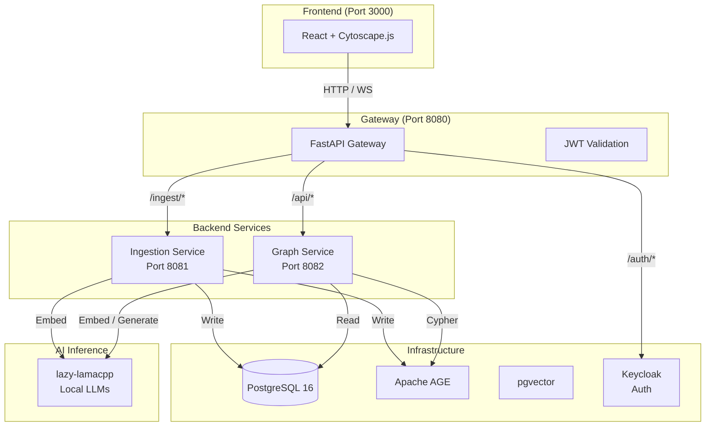
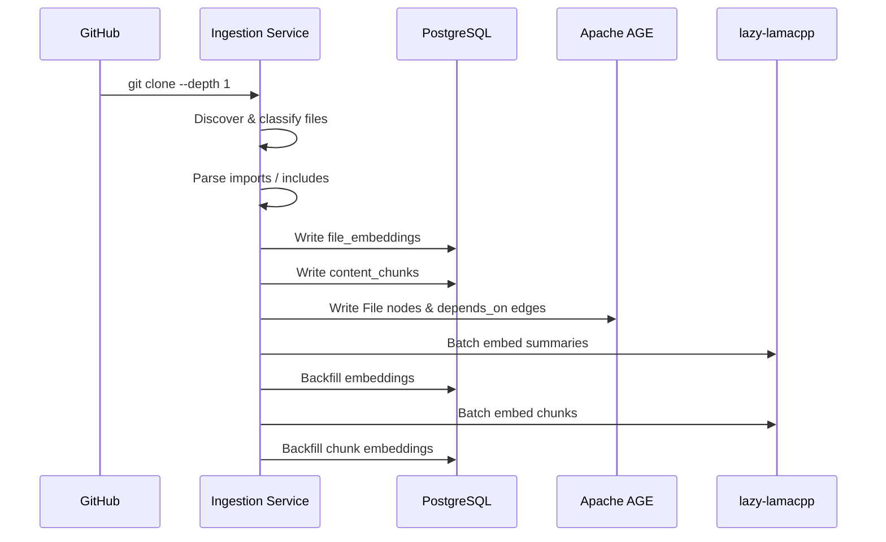
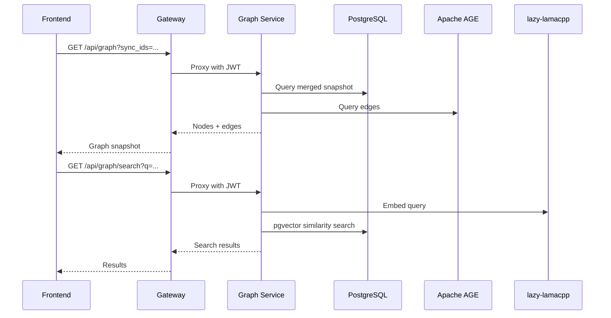

# Architecture

Substrate Platform follows a **microservices architecture** with clear separation of concerns. The current implementation focuses on GitHub source ingestion, graph visualization, and semantic search.

---

## Architecture Principles

1. **No Mock Data**: Every node and edge comes from real repository analysis
2. **Stateless Services**: Business logic services are stateless; state lives in PostgreSQL
3. **Graph-First**: The Apache AGE graph inside PostgreSQL is the primary graph model
4. **Real-Time by Default**: WebSocket connections stream live updates to clients
5. **Local AI**: All LLM inference runs on self-hosted hardware — no external API calls

---

## High-Level Architecture

---

## Service Overview

| Service | Port | Language | Purpose |
|---------|------|----------|---------|
| **Gateway** | 8080 | Python/FastAPI | JWT auth, routing, WebSocket proxy |
| **Ingestion** | 8081 | Python/FastAPI | GitHub connector, sync orchestration, embeddings |
| **Graph Service** | 8082 | Python/FastAPI | Graph queries, semantic search, LLM summaries |
| **Frontend** | 3000 | React/TypeScript | Dashboard UI with Cytoscape graph |

---

## Infrastructure Components

| Component | Technology | Purpose |
|-----------|------------|---------|
| **Primary Database** | PostgreSQL 16 | Relational data, embeddings, graph queries |
| **Graph Extension** | Apache AGE | Cypher graph queries inside PostgreSQL |
| **Vector Extension** | pgvector | 1024-dimensional embeddings |
| **Identity** | Keycloak | OIDC auth, JWT issuance |
| **AI Inference** | lazy-lamacpp | Local embedding and dense LLM serving |

---

## Data Flow

### Ingestion Pipeline

### Query Flow

---

## Deployment Architecture

Substrate is designed for **self-hosted first** deployment:

- Docker Compose for development and production
- All components run on customer's infrastructure
- Zero external API dependencies for AI inference
- Infrastructure provided by `home-stack` (PostgreSQL, Keycloak)

See [Deployment](deployment.md) for detailed deployment patterns.

---

## Next Steps

- [Architecture Overview](overview.md) — Detailed system design
- [Data Model](data-model.md) — Graph and relational schemas
- [Tech Stack](tech-stack.md) — Technology choices and rationale
- [Deployment](deployment.md) — Deployment patterns and configuration
