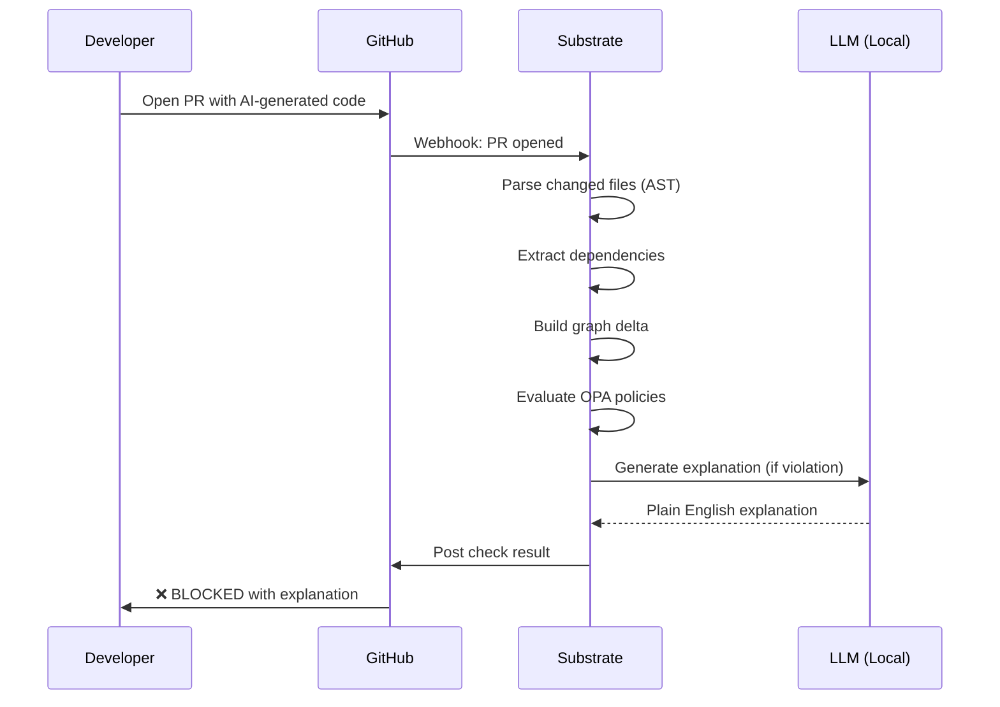

# AI Code Governance

**AI code assistants generate architectural violations faster than human reviewers can catch them.**

---

## The AI Slop Crisis

AI code generation has crossed the adoption threshold:
- **70%** of developers use AI assistants
- **30-40%** of code is AI-generated
- Quality crisis emerging in real-time

### What is AI Slop?

AI-generated code that is:
- **Syntactically correct** — compiles, passes linters
- **Architecturally incoherent** — violates patterns, boundaries, constraints
- **Invisibly dangerous** — passes review, causes drift

### Common AI Violations

| Violation | Example | Impact |
|-----------|---------|--------|
| **Layer bypass** | Direct DB access from API layer | Violates separation of concerns |
| **Circular dependency** | Service A → B → C → A | Unmaintainable, hard to test |
| **Scope creep** | Business logic in controller | Technical debt accumulation |
| **Shadow dependency** | Import from wrong domain | Coupling violation |
| **Security gap** | Missing auth check | Vulnerability |
| **Pattern violation** | Transaction script in DDD service | Architectural inconsistency |

---

## Why Current Tools Fail

### Linters (ESLint, pylint)

**Check:** Syntax, style, basic bugs  
**Miss:** Architectural intent, domain boundaries

### SAST (SonarQube, Snyk)

**Check:** Vulnerabilities, code smells  
**Miss:** Structural violations, pattern conformance

### Code Review (Human)

**Check:** Logic, style, some architecture  
**Miss:** 200+ PRs/week, reviewer fatigue, "LGTM" approvals

**The Math:**
- 10 engineers × 3 PRs/day × 5 days = 150 PRs/week
- Senior engineer can review 20-30 deeply
- **80% get superficial review**

---

## The Substrate Solution

### Active Governance at the PR Level



### Time to Detect: <2 seconds

Every PR is evaluated against:
- Active Rego policies
- Declared architecture
- Historical patterns
- Domain boundaries

### Violation Example

**PR Opened:**
```typescript
// AI-generated code
import { db } from '../db';

export async function getUser(id: string) {
  return db.query('SELECT * FROM users WHERE id = ?', [id]);
}
```

**Substrate Detection:**
```
❌ POLICY VIOLATION: layer-boundary

Direct database access from API layer detected.

Policy: layer-boundary (POLICY-003)
Severity: Hard-mandatory
File: src/api/user.ts:4

WHY this rule exists:
- ADR-021: Repository pattern mandate
- Incident POST-015: SQL injection from API layer (2024-01)

Required: Use UserRepository.getById() instead
Fix suggestion: [View Fix PR]

Override: Request exception with justification
```

**Developer experience:** Immediate feedback, context, fix suggestion.

---

## Policy Packs for AI Governance

### 1. No Circular Dependencies

```rego
package substrate.circular

deny[msg] {
    # Find cycles using graph traversal
    cycle := graph.reachable_with_path(input.dependencies, [])
    count(cycle) > 0
    msg := sprintf("Circular dependency detected: %v", [cycle])
}
```

**Detects:** Service A → B → C → A patterns

### 2. API Gateway First

```rego
package substrate.gateway

deny[msg] {
    call := input.service_calls[_]
    call.target_domain != call.source_domain
    not call.via_gateway
    msg := sprintf("Cross-domain call from %s to %s must route via gateway", 
                   [call.source, call.target])
}
```

**Detects:** Direct service-to-service calls bypassing gateway

### 3. SOLID Principles

```rego
package substrate.solid

# Single Responsibility: efferent coupling <= 5
deny[msg] {
    service := input.services[_]
    count(service.dependencies) > 5
    msg := sprintf("Service %s violates SRP: %d dependencies", 
                   [service.name, count(service.dependencies)])
}

# Dependency Inversion: domain must not depend on infra
deny[msg] {
    dep := input.dependencies[_]
    dep.source_type == "domain"
    dep.target_type == "infrastructure"
    msg := sprintf("Domain service %s depends on infrastructure", [dep.source])
}
```

### 4. License Compliance

```rego
package substrate.license

deny[msg] {
    dep := input.dependencies[_]
    dep.license in ["GPL", "AGPL"]
    input.service.commercial
    msg := sprintf("GPL dependency %s in commercial service %s", 
                   [dep.name, input.service.name])
}
```

**Detects:** License conflicts before merge

---

## The Explanation Layer

### Why Deterministic + AI-Generated Explanations

**Deterministic evaluation (OPA):**
- Pass/fail: Consistent, explainable
- Performance: <5ms per policy
- Trust: Same result every time

**AI-generated explanations (LLM):**
- Context: Links to ADRs, incidents
- Education: Teaches why rule exists
- Action: Suggests fixes

**Example Explanation:**

```
This PR violates the api-gateway-first policy because it adds a 
direct import from the payment domain to the auth domain.

WHY this matters:
In November 2023, a direct call from OrderService to AuthService 
bypassed rate limiting, causing a cascading failure. Post-mortem 
POST-019 mandated that all cross-domain calls route through the 
api-gateway for traffic shaping and circuit breaking.

HOW to fix:
Replace the direct call with:
  const auth = await gateway.authenticate(token);

The gateway will handle routing, retries, and failures.

Questions? See ADR-047 or ask in #architecture.
```

---

## Fix PR Generation

For deterministic fixes, Substrate can generate the correction:

**Violation:**
```typescript
// Violation: direct DB access
const user = await db.query('SELECT * FROM users WHERE id = ?', [id]);
```

**Fix PR Generated:**
```typescript
// Fix: Use repository pattern
import { UserRepository } from '../repositories/user';
const user = await UserRepository.findById(id);
```

**Process:**
1. Qwen2.5-Coder generates fix
2. Simulation verifies fix resolves violation
3. Fix PR opened with explanation
4. Developer reviews and merges

---

## Intent Mismatch Detection

### The Problem

PR description says: "Fix UI bug"  
Code changes: Database schema modifications

### Substrate Detection

1. Embed PR description
2. Embed code changes
3. Compute cosine similarity
4. Flag if similarity < 0.6

**Alert:**
```
⚠️ INTENT MISMATCH DETECTED

PR title: "Fix user profile display"
Code changes: Database migration, API endpoint modifications

Similarity score: 0.34 (threshold: 0.60)

Possible issues:
- Unintended changes included in PR
- Missing context in PR description
- Scope creep

Review carefully before approval.
```

---

## Measuring AI Governance Success

### Key Metrics

| Metric | Target | Why |
|--------|--------|-----|
| Violations caught/week | >10 | Sufficient coverage |
| False positive rate | <5% | Trust |
| Time to fix | <1 hour | Efficiency |
| Developer satisfaction | >4.0/5 | Adoption |

### Trend Analysis

```
Violations per week:
- Week 1: 45 (high initial drift)
- Week 4: 25 (improving)
- Week 12: 8 (team learned patterns)
- Week 24: 3 (mature governance)

Interpretation: Education working, fewer new violations
```

### Policy Evolution

| Month | Active Policies | Violations | Trend |
|-------|-----------------|------------|-------|
| 1 | 3 | 45 | Baseline |
| 3 | 6 | 25 | Improving |
| 6 | 8 | 12 | Maturing |
| 12 | 10 | 5 | Optimized |

---

## Developer Experience

### IDE Integration (Future)

```typescript
// VS Code: Real-time violation highlighting
const user = await db.query('...');
//      ^^^ 💡 Substrate: Use UserRepository
//              Click to see WHY and fix
```

### Slack Integration

```
Substrate Bot: @channel
3 PRs need architecture review:
- #234: API layer violation
- #235: Circular dependency
- #236: License conflict

Review: https://substrate.company.com/review-queue
```

---

## ROI: AI Governance

### Before Substrate

| Cost | Calculation | Annual |
|------|-------------|--------|
| Violations reaching prod | 10 × $20K fix | $200K |
| Review time | 40% × $2M payroll | $800K |
| Security incidents | 2 × $100K | $200K |
| **Total** | | **$1.2M** |

### With Substrate

- Subscription: $6K/year
- Review time reduced: 20% → $400K
- Violations caught: 95% before prod

**Net savings: $794K/year (132x ROI)**

---

## Success Story: High-Growth Startup

**Challenge:** 50 engineers, 70% using Copilot, codebase quality declining rapidly.

**Before:**
- Circular dependencies emerging weekly
- Layer violations in 30% of PRs
- Staff engineer spent 60% time reviewing

**With Substrate:**
- Policy violations caught: 180 in first month
- Violations reaching prod: <5%
- Staff engineer time recovered: 40%

**Result:** Quality stabilized, velocity maintained, team scaled to 100 engineers without quality collapse.
