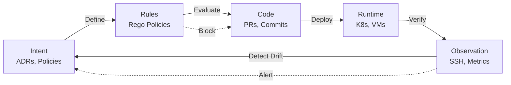

# Governance Gaps

**The missing enforcement layer between architectural intent and implementation reality.**

---

## The Governance Problem

Organizations have plenty of "governance" — documents, meetings, approvals — but lack **computable governance** that actively maintains alignment.

### The Governance Stack

| Layer | Current State | Gap |
|-------|---------------|-----|
| **Intent** | Architecture docs, ADRs, policies | Static, ignored |
| **Planning** | Roadmaps, designs, estimates | Decoupled from reality |
| **Implementation** | Code, infrastructure | Unvalidated |
| **Observation** | Monitoring, logs | Symptom-only |
| **Response** | Post-mortems, tickets | Reactive |

**The Gap:** No layer actively validates implementation against intent in real-time.

---

## Types of Governance Gaps

### 1. Intent-to-Code Gap

**The Problem:**
- Architecture says: "All services use the API gateway"
- Code says: Direct HTTP calls between services
- Result: Violation invisibly persists

**Substrate Solution:**
```
Policy: api-gateway-first
Enforcement: HARD_MANDATORY
Detection: Static analysis of imports + runtime verification
Action: Block PR + Explain WHY
```

### 2. Code-to-Runtime Gap

**The Problem:**
- Code declares: "Service runs on port 8080"
- Runtime shows: Service on port 8081
- Result: Drift undetected

**Substrate Solution:**
```
SSH Runtime Connector
Frequency: Every 15 minutes
Detection: systemctl + ss + docker inspect
Action: Alert on divergence
```

### 3. Decision-to-Policy Gap

**The Problem:**
- Post-mortem says: "We should prevent this"
- Policy never created
- Result: Same incident recurs

**Substrate Solution:**
```
Memory Decay Detection
Check: FailurePattern nodes without linked Policy
Action: Alert: "POST-019 has no preventive policy"
Recommendation: Create POLICY-013
```

### 4. Policy-to-Enforcement Gap

**The Problem:**
- Policy documented: "No GPL in commercial code"
- No automated check
- Result: GPL library merged

**Substrate Solution:**
```
OPA/Rego Policies
Evaluation: Every PR
Enforcement: Block merge on violation
Audit: Complete evaluation log
```

### 5. Knowledge-to-Action Gap

**The Problem:**
- Knowledge exists: "Alice knows why this constraint exists"
- Alice leaves
- Result: Constraint violated unknowingly

**Substrate Solution:**
```
WHY Layer
Capture: ADR + Post-mortem + Design rationale
Query: Natural language → Provenance
Result: Knowledge survives turnover
```

---

## The Substrate Governance Model

### Continuous Validation Loop



### Governance as Code

**Traditional:**
```
Architecture Review Board meets monthly
Reviews 5% of changes
Approves based on presentation quality
No enforcement mechanism
```

**Substrate:**
```rego
package substrate.governance

# Architecture policy as executable code
deny[msg] {
    # Must have approved ADR for new services
    new_service := input.changes.new_services[_]
    not has_approved_adr(new_service)
    msg := sprintf("New service %s requires approved ADR", [new_service.name])
}

deny[msg] {
    # Must not increase coupling beyond threshold
    service := input.services[_]
    new_deps := count(input.changes.added_dependencies[service.name])
    current_deps := count(service.dependencies)
    new_deps + current_deps > 10
    msg := sprintf("Service %s would have %d dependencies (max 10)", 
                   [service.name, new_deps + current_deps])
}
```

**Evaluation:** Every PR, <5ms, deterministic, explainable

---

## Governance Layers

### 1. Preventive Governance

**When:** Before code is written  
**How:** Simulation, what-if analysis

**Example:**
```
> "What if I split OrderService?"

Simulation:
- Affected services: 12
- Policy violations introduced: 4
- Blast radius: 3 hops
- Drift delta: +0.15

Recommendation: REVIEW REQUIRED
Consider: Creating ADR first, gradual migration
```

### 2. Detective Governance

**When:** During PR review  
**How:** Static analysis, policy evaluation

**Example:**
```
❌ BLOCKED: architectural-boundary

Direct import from payment domain to auth domain.
Must route via api-gateway-prod.

See: ADR-047, POLICY-012
Exception: Request with justification
```

### 3. Corrective Governance

**When:** Post-deployment  
**How:** Runtime verification, drift detection

**Example:**
```
⚠️ RUNTIME VIOLATION

Host: prod-worker-03
Undeclared service: unknown-payment-worker
Declared: payment-worker on prod-worker-01,02

Action: Investigate or add to graph
Risk: Shadow processing, audit failure
```

### 4. Adaptive Governance

**When:** Continuous  
**How:** Verification queue, memory curation

**Example:**
```
Memory Gap Detected:
Service: inventory-service
Missing: ADR for database choice
Staleness: 180 days since last review

Action: Assign to architect for documentation
```

---

## Governance Dashboards

### Health Scorecard

| Domain | Drift Score | Violations | Memory Coverage | Status |
|--------|-------------|------------|-----------------|--------|
| Payments | 0.12 | 2 | 85% | 🟢 |
| Auth | 0.08 | 0 | 92% | 🟢 |
| Orders | 0.34 | 5 | 60% | 🟡 |
| Legacy | 0.67 | 12 | 40% | 🔴 |

### Violation Trends

```
Weekly Violations:
- Prevented at PR: 45
- Detected in runtime: 3
- Escaped to prod: 0

Trend: ↓ 20% from last month
Interpretation: Team learning, policies effective
```

### Policy Compliance

| Policy | Scope | Pass Rate | Trend |
|--------|-------|-----------|-------|
| api-gateway-first | All services | 98% | ↑ |
| no-circular-deps | Core domain | 95% | → |
| service-ownership | New services | 100% | ✓ |
| license-compliance | All deps | 99.5% | ↑ |

---

## Governance Roles

### Automated (System)

| Role | Actions |
|------|---------|
| Enforcer | Block PRs violating hard-mandatory policies |
| Monitor | Detect runtime drift every 15 minutes |
| Curator | Verify memory accuracy, flag staleness |
| Educator | Suggest fixes, explain WHY |

### Human-in-the-Loop

| Role | Actions |
|------|---------|
| Architect | Define policies, approve exceptions |
| Tech Lead | Review violations, guide team |
| Developer | Understand constraints, request exceptions |
| Security | Define compliance policies |

### Confidence-Based Routing

| Confidence | System Action | Human Role |
|------------|---------------|------------|
| >90% | Auto-accept | None |
| 60-90% | Queue for review | Team member (7 days) |
| <60% | Escalate | Team lead / Architect |

---

## Compliance and Audit

### Automated Attestation

**Auditor asks:** "How do you ensure architectural standards are enforced?"

**Traditional response:**
- Manual evidence collection: 80 hours
- Spot checks of 5% of changes
- Subjective compliance

**Substrate response:**
```
Evidence Package:
- Policy evaluation log: 100% of PRs, 12 months
- Violation detection: 2,847 caught, 3 escaped
- Remediation time: avg 4.2 hours
- Drift scores: Monthly trend, all domains
- Policy coverage: 12 active, 98% compliance

Format: JSON export, machine-readable
Time to generate: 5 minutes
```

### Regulatory Compliance

| Regulation | Substrate Support |
|------------|-------------------|
| SOC 2 | Automated evidence, audit trails |
| PCI-DSS | Network boundary validation |
| GDPR | Data flow mapping, retention policies |
| DORA | Operational resilience metrics |
| FDA 21 CFR Part 11 | Electronic records, audit trails |

---

## Measuring Governance Maturity

### Level 1: Documented
- Architecture exists in documents
- Policies written but not enforced
- Manual reviews spotty

### Level 2: Detected
- Automated detection of violations
- Alerts for drift
- Reactive response

### Level 3: Prevented
- PR blocking for violations
- Simulation before implementation
- Proactive governance

### Level 4: Optimized
- Self-healing systems
- Predictive drift detection
- Continuous improvement

**Substrate target:** Level 3+ for all customers

---

## Success Metrics

### Governance Effectiveness

| Metric | Baseline | Target | Best |
|--------|----------|--------|------|
| Violations prevented | 0% | 90% | 99% |
| Time to detect drift | Months | Minutes | Real-time |
| Policy compliance | Unknown | 95% | 99% |
| Memory coverage | 20% | 80% | 95% |
| Audit prep time | 80 hrs | 4 hrs | 1 hr |

### Business Outcomes

| Outcome | Measurement |
|---------|-------------|
| Reduced incidents | -50% architecture-related |
| Faster audits | -90% preparation time |
| Knowledge retention | +80% after turnover |
| Developer productivity | +30% (less review overhead) |
