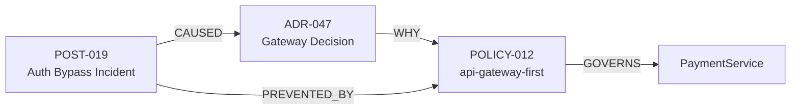

# Institutional Memory Loss

**The silent erosion of why the system was built the way it was.**

---

## The Problem

When engineers leave, they take context with them. When decisions are made, they're filed and forgotten. When incidents occur, lessons are learned and lost.

### The Half-Life of Knowledge

| Source | Half-Life | Why |
|--------|-----------|-----|
| Tribal knowledge | 2.1 years | Engineer turnover |
| Confluence docs | 6 months | Staleness |
| PR comments | Immediate | Buried in history |
| Slack threads | 90 days | Message limits |
| Post-mortems | 1 incident | Filed and forgotten |

### The Cost of Lost Memory

**New engineer asks:** "Why does PaymentService have to go through the API gateway?"

**Without Substrate:**
1. Ask in Slack: "Anyone know?"
2. Wait 2 hours
3. Get response: "Alice might know, but she left last year"
4. Spend 2 days reading old PRs
5. Make wrong decision due to missing context
6. Introduce vulnerability
7. Post-mortem reveals: "We knew this in 2023"

**Time lost:** 2 days + incident cost  
**Knowledge permanently lost:** Yes

---

## Memory Types Captured

### 1. Architecture Decision Records (ADRs)

**What:** Formal records of architectural decisions

**Captured:**
- Title and context
- Decision and consequences
- Author and date
- Status (active/superseded)
- Linked services and policies

**Example:**
```yaml
adr_id: ADR-047
title: API Gateway Enforcement for Payment Flows
context: November 2023 incident where direct service calls bypassed auth
decision: All payment domain services MUST route via api-gateway-prod
consequences:
  positive: ["mTLS enforced", "Rate limiting applied"]
  negative: ["Added latency ~5ms"]
author: alice@company.com
date: 2023-11-14
status: active
linked_services: [payment-service, api-gateway-prod]
linked_policies: [POLICY-012]
```

**Query:**
> "Why does PaymentService require the gateway?"

**Answer:**
> ADR-047: Direct service-to-service calls bypassed auth middleware in the November incident. Gateway enforces mTLS and rate limiting for all payment flows.

### 2. Post-Mortem Lessons

**What:** Root cause analysis and preventive measures

**Captured:**
- Incident description
- Root cause
- Impact assessment
- Preventive actions
- Linked to failure patterns

**Example:**
```yaml
incident_id: POST-019
title: Payment Service Authentication Bypass
severity: P1
root_cause: Direct DB call from OrderService bypassed PaymentService validation
linked_services: [order-service, payment-service]
lesson: All data access MUST go through domain services, never direct to DB
policy_created: POLICY-013
```

### 3. Design Rationale

**What:** Why specific implementation choices were made

**Source:** PR review comments, design docs

**Example:**
```yaml
source: PR #2341
author: bob@company.com
service: inventory-service
rationale: "Used eventual consistency because real-time inventory would require distributed locks, adding 50ms latency unacceptable for checkout flow"
linked_decision: ADR-038
```

### 4. Policy Exceptions

**What:** Why a policy was waived in a specific case

**Example:**
```yaml
exception_id: EXC-007
policy: POLICY-012
service: legacy-billing
rationale: "Cannot retrofit gateway routing due to external API contracts. Compensating controls: dedicated VPC, IP whitelisting, audit logging."
approved_by: cto@company.com
expiry: 2025-12-31
```

### 5. Informal Decisions

**What:** Team decisions captured from Slack or meetings

**Source:** Slack keyword triggers ("#decision"), meeting transcripts

**Example:**
```yaml
source: Slack #engineering
date: 2024-01-15
decision: "We'll standardize on PostgreSQL 16 for all new services"
context: Team discussion on database选型
confidence: 0.85  # Will be verified in queue
```

---

## The WHY Layer

Substrate treats memory as **first-class graph citizens** linked via WHY edges:



### Querying Memory

**Question:** "Why was this constraint introduced?"

**Graph traversal:**
```cypher
MATCH (s:Service {name: 'PaymentService'})<-[:GOVERNS]-(p:Policy)
MATCH (p)<-[:WHY]-(adr:DecisionNode)
MATCH (adr)<-[:CAUSED]-(incident:FailurePattern)
RETURN 
  p.name as policy,
  adr.title as decision,
  incident.description as cause,
  [n in nodes(path) | n.source_url] as sources
```

**Result:**
```json
{
  "policy": "api-gateway-first",
  "decision": "ADR-047: API Gateway Enforcement",
  "cause": "POST-019: Authentication Bypass Incident",
  "sources": [
    "https://github.com/company/adr/blob/main/047-gateway-enforcement.md",
    "https://wiki.company.com/post-mortems/019"
  ]
}
```

---

## Verification Queue

Not all captured memory is equally reliable. Substrate runs a **verification queue** to maintain quality.

### Confidence Scoring

| Factor | Weight | Description |
|--------|--------|-------------|
| Source trust | 0.3 | ADR > PR comment > Slack |
| Author seniority | 0.2 | Staff+ > Senior > Junior |
| Age | 0.2 | Decay over time |
| Cross-references | 0.2 | Links to policies/incidents |
| Review status | 0.1 | Approved vs draft |

### Confidence Bands

| Score | Action | Who |
|-------|--------|-----|
| >90% | Auto-accept | System |
| 60-90% | Human review (7 days) | Owning team |
| <60% | Expert review | Team lead |

### Staleness Detection

| Memory Type | Staleness Threshold | Trigger |
|-------------|---------------------|---------|
| Service dependencies | 14 days | PR touching service |
| API contracts | 30 days | Deployment |
| Ownership | 90 days | Org change |
| ADRs | 180 days | Sprint close |
| Post-mortems | 365 days | New incident |

---

## Memory in Action

### Scenario: The New Engineer

**Day 1:** Developer joins, asks Substrate:
> "Why can't I call the database directly from the API layer?"

**Substrate responds:**
1. **Policy:** POLICY-013 — Domain services MUST control data access
2. **ADR:** ADR-038 — Repository pattern enforcement
3. **Incident:** POST-019 — Direct DB call bypassed validation (Nov 2023)
4. **Lesson:** $2M fraud loss from validation bypass
5. **Fix:** Use PaymentService.validate() before any transaction

**Time to answer:** 5 seconds  
**Confidence:** 94%  
**Sources:** 4 linked documents

### Scenario: The Departure

**Alice (Staff Engineer) announces departure.**

**Substrate automatically:**
1. Identifies services Alice exclusively owns: 3 critical
2. Flags in verification queue: CRITICAL priority
3. Notifies engineering manager
4. Suggests knowledge transfer sessions
5. Schedules ADR review for Alice's undocumented decisions

**Result:** No knowledge lost, proactive redistribution.

---

## ROI of Institutional Memory

### Cost of Lost Knowledge

| Event | Cost | Frequency |
|-------|------|-----------|
| Engineer departure | $100K (3 months re-discovery) | 5/year |
| Repeated mistakes | $50K/incident | 4/year |
| Slow onboarding | $20K/engineer × 10 | 10/year |
| Wrong architectural decisions | $200K | 2/year |
| **Total** | **$1.4M/year** | — |

### Substrate Value

- Memory retrieval: <5 seconds vs days
- Departure risk: Proactive vs reactive
- Onboarding: 2 weeks vs 6 weeks
- Decision quality: Informed vs guessing

**Net savings: $1M+/year**

---

## Measuring Memory Health

### Memory Coverage

```
Services with ADRs: 78%
Services with documented rationale: 65%
Post-mortems encoded as policies: 45%
Overall memory health: C+ (needs improvement)
```

### Memory Gaps

| Gap Type | Count | Action |
|----------|-------|--------|
| Services without ADRs | 12 | Assign to architects |
| Stale ADRs (>180d) | 8 | Schedule review |
| Unencoded post-mortems | 3 | Create policies |
| Key-person risk | 2 | Immediate action |

---

## Success Stories

### Company A: Financial Services

**Before:** 40% of senior engineers left in 6 months. New team re-introduced anti-patterns deprecated 2 years prior.

**With Substrate:**
- WHY queries answer 80% of "why" questions without human help
- Departure risk detected 30 days in advance
- ADR coverage increased from 20% to 85%

**Result:** Zero knowledge-loss incidents in 12 months.

### Company B: High-Growth Startup

**Before:** 5 new engineers/month, each asking same questions repeatedly. Senior engineers spent 40% of time answering.

**With Substrate:**
- Slack questions reduced by 70%
- Onboarding time: 6 weeks → 2 weeks
- Senior engineer productivity recovered

**Result:** 30% improvement in senior engineer output.
