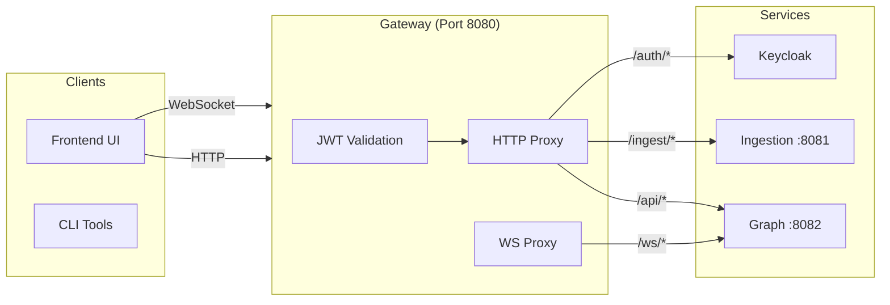

# Gateway Service

**Port:** 8080  
**Language:** Python 3.12 / FastAPI  
**Repository:** `services/gateway/`

---

## Overview

The Gateway is the **single ingress point** for all external traffic. It is intentionally thin — it authenticates requests and proxies them to downstream services without transforming payloads.

---

## Responsibilities

1. **JWT Authentication**: Validates Bearer tokens via Keycloak JWKS
2. **Request Routing**: Proxies HTTP requests to Graph or Ingestion services
3. **WebSocket Proxying**: Upgrades and relays WS connections to the Graph Service
4. **CORS Handling**: Configured for frontend origins
5. **Connection Resilience**: Retry logic and keepalive tuning for upstream calls

---

## Architecture



---

## Authentication Flow

### JWT Validation

1. Extract Bearer token from `Authorization` header (HTTP) or `?token=` query param (WebSocket)
2. Parse the unverified JWT header to get `kid` (key ID)
3. Fetch JWKS from Keycloak (cached with 5-minute TTL)
4. Validate:
   - Signature (RS256)
   - Expiration (`exp`)
   - Issuer (`iss`)
   - **Audience is NOT verified** (`verify_aud=False`)
5. If valid, proxy the request upstream

### WebSocket Auth

Token passed as query parameter:
```
ws://localhost:8080/ws/graph?token=<JWT>
```

The Gateway validates the token on the upgrade request, then proxies the raw WebSocket bi-directionally.

---

## Routing Logic

### Smart Routing to Ingestion

Write requests to `/api/syncs*` and `/api/schedules*` are selectively routed to the **ingestion service**; everything else (including all `GET`s) goes to the **graph service**.

| Route | Methods | Destination | Description |
|-------|---------|-------------|-------------|
| `GET /health` | GET | Gateway | Liveness check |
| `/api/*` | GET, POST, PUT, DELETE, PATCH | Graph Service | Read operations + non-sync writes |
| `/api/syncs*` | POST, DELETE | Ingestion Service | Sync lifecycle commands |
| `/api/syncs*` | PUT, PATCH | Graph Service | Sync updates (read proxy) |
| `/api/schedules*` | POST, PATCH, DELETE | Ingestion Service | Schedule commands |
| `/api/schedules*` | PUT | Graph Service | Schedule updates (read proxy) |
| `/ingest/*` | GET, POST, PUT, DELETE, PATCH | Ingestion Service | Direct ingestion proxy |
| `/auth/*` | GET, POST, PUT, DELETE, PATCH | Keycloak | OIDC endpoints proxy |
| `/ws/*` | WebSocket | Graph Service | WebSocket proxy |

---

## Key Modules

### `config.py`

Pydantic `BaseSettings` configuration:

| Variable | Default | Purpose |
|----------|---------|---------|
| `KEYCLOAK_URL` | `http://local-keycloak:8080` | Keycloak base URL |
| `KEYCLOAK_REALM` | `substrate` | Realm name |
| `KEYCLOAK_ISSUER` | `""` | Override JWT issuer |
| `GRAPH_SERVICE_URL` | `http://substrate-graph:8082` | Graph service base URL |
| `INGESTION_SERVICE_URL` | `http://substrate-ingestion:8081` | Ingestion service base URL |
| `REDIS_URL` | `redis://local-redis:6379` | **Currently unused** |

### `auth.py`

- `validate_token(token, public_key, issuer)`: Decodes and validates JWT
- `JWKSClient`: Fetches and caches JWKS from Keycloak with TTL-based refresh and background refresh on stale cache

### `proxy.py`

- `init_client()` / `close_client()`: Manages a global `httpx.AsyncClient`
- `proxy_request()`: Forwards requests with app-level retries (up to 3 attempts, exponential backoff) for idempotent methods on connection errors
- `proxy_websocket()`: Bi-directional relay between client and upstream WebSocket

### `main.py`

FastAPI application with lifespan management:
- Initializes `JWKSClient` and proxy HTTP client on startup
- Closes the proxy client on shutdown
- Mounts CORS middleware
- Defines route handlers for all paths

---

## Configuration

```python
# Environment variables
KEYCLOAK_URL = "http://local-keycloak:8080"
KEYCLOAK_REALM = "substrate"
GRAPH_SERVICE_URL = "http://substrate-graph:8082"
INGESTION_SERVICE_URL = "http://substrate-ingestion:8081"

# JWT settings (hardcoded)
JWT_ALGORITHM = "RS256"      # algorithms=["RS256"] in auth.py
JWKS_CACHE_TTL = 300         # JWKS_TTL_SECONDS = 300 in auth.py
```

---

## Key Implementation Details

### HTTP Connection Pooling

Shared `httpx.AsyncClient` at app startup:

```python
limits = httpx.Limits(
    max_connections=100,
    max_keepalive_connections=20,
    keepalive_expiry=2.0
)
client = httpx.AsyncClient(limits=limits)
```

The `keepalive_expiry=2.0s` is intentionally shorter than uvicorn's default 5s idle timeout to prevent reuse of stale pooled connections.

### Error Handling

| Error | Response |
|-------|----------|
| Invalid JWT | 401 Unauthorized |
| Expired JWT | 401 Unauthorized |
| Upstream connect error | 503 Service Unavailable |
| Upstream timeout | 504 Gateway Timeout |
| Persistent disconnect | 502 Bad Gateway |

---

## Deployment

```dockerfile
FROM python:3.12-slim

COPY --from=ghcr.io/astral-sh/uv:latest /uv /usr/local/bin/uv

WORKDIR /app

COPY pyproject.toml .
RUN uv sync --no-dev --frozen 2>/dev/null || uv sync --no-dev

COPY src/ src/

EXPOSE 8080

CMD ["uv", "run", "uvicorn", "src.main:app", "--host", "0.0.0.0", "--port", "8080"]
```

---

## Monitoring

### Health Check Response

```json
{
  "status": "ok"
}
```

### Metrics

Structured logs include:
- `gateway_started` / `gateway_stopped` lifecycle events
- `auth_failed` warnings
- `upstream_error` warnings on proxy failures
- `jwks_refreshed` when the JWKS cache is updated

Per-request metrics (request count, response time, JWKS cache hit rate) are **not** currently emitted.
