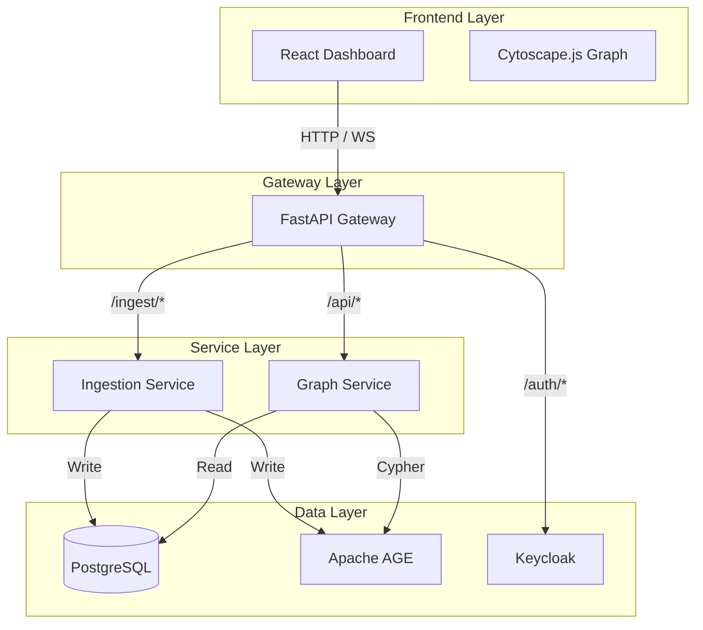

# System Design

This section provides detailed design documentation for each component of the Substrate Platform.

---

## Services Overview

---

## Service Responsibilities

| Service | Core Responsibility | Key Technologies |
|---------|---------------------|------------------|
| **Gateway** | Single ingress point, auth enforcement, HTTP/WS proxy | FastAPI, JWT, httpx |
| **Ingestion** | GitHub connector, sync orchestration, chunking, embeddings | FastAPI, asyncpg, Apache AGE |
| **Graph Service** | Graph queries, semantic search, LLM summaries | FastAPI, asyncpg, pgvector, Apache AGE |
| **Frontend** | Dashboard UI, graph visualization, source management | React, Vite, Cytoscape.js, Zustand |

---

## Communication Patterns

### Synchronous (REST)
- Frontend → Gateway → Services
- Request/response for all queries and commands
- JWT authentication on every request

### Real-Time (WebSocket)
- Gateway proxies WebSocket connections to the Graph Service
- Currently used for live connections; delta streaming is planned

### Data Flow
- Ingestion directly writes to shared PostgreSQL + AGE
- Graph Service reads from the same database
- No message bus in the current implementation

---

## Design Principles

1. **Single Responsibility**: Each service owns one domain
2. **Shared Database**: PostgreSQL + AGE serves as the unified store for graph and relational data
3. **No Mock Data**: All graph elements come from real source code analysis
4. **Idempotency**: Ingestion operations are safe to retry
5. **Graceful Degradation**: Services continue with reduced functionality when dependencies fail

---

## Service Documentation

- [Gateway Service](gateway.md) — Authentication, routing, WebSocket proxying
- [Ingestion Service](ingestion.md) — Connectors, sync lifecycle, scheduling
- [Graph Service](graph-service.md) — Graph queries, search, summaries
- [Frontend](frontend.md) — React dashboard, Cytoscape graph
- [Infrastructure](infrastructure.md) — PostgreSQL, Apache AGE, Keycloak
- [Graph Edge Symbols](graph-edge-symbols.md) — Edge glyph reference for the node detail panel
