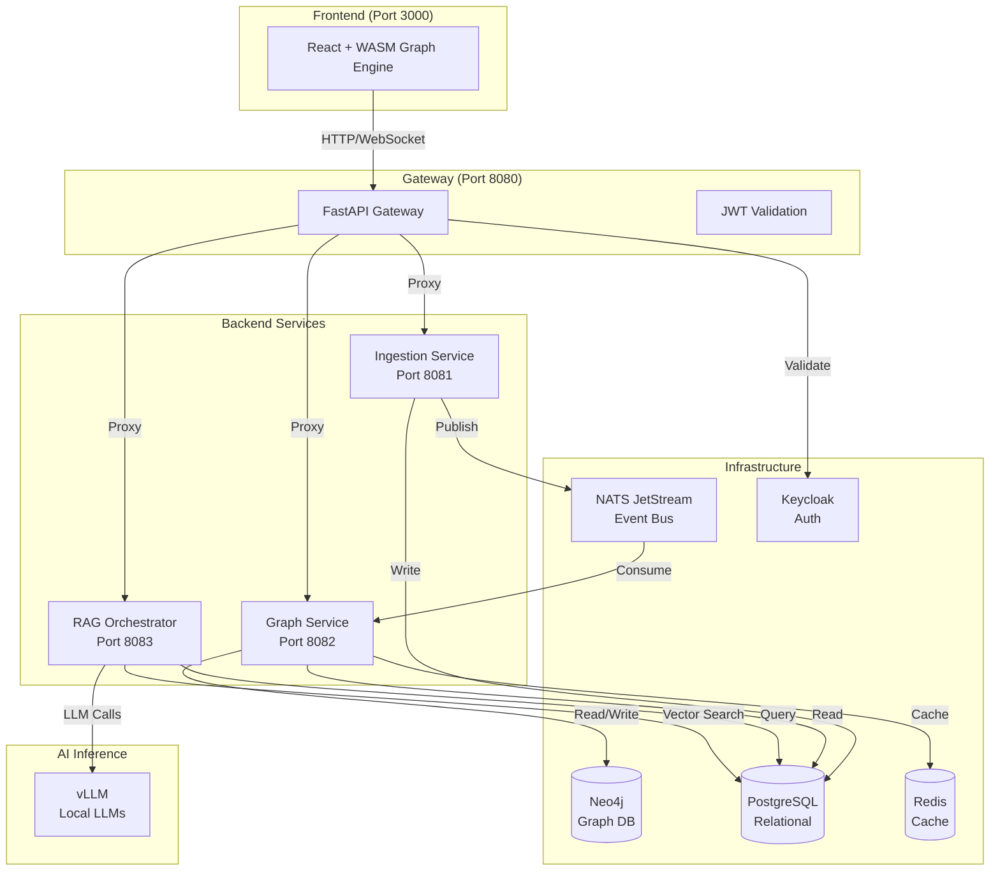
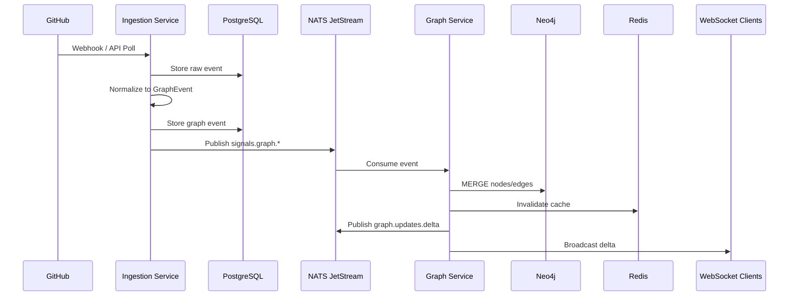
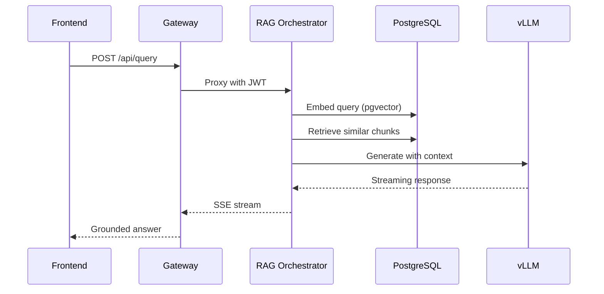

# Architecture

Substrate Platform follows a **microservices architecture** with clear separation of concerns, event-driven communication, and horizontally scalable components.

---

## Architecture Principles

1. **Event-Driven**: All inter-service communication happens through NATS JetStream
2. **Stateless Services**: Business logic services are stateless; state lives in databases
3. **Graph-First**: The Neo4j graph is the primary data model; relational stores support it
4. **Real-Time by Default**: WebSocket connections stream live updates to clients
5. **Local AI**: All LLM inference runs on self-hosted hardware — no external API calls

---

## High-Level Architecture

---

## Service Overview

| Service | Port | Language | Purpose |
|---------|------|----------|---------|
| **Gateway** | 8080 | Python/FastAPI | JWT auth, routing, rate limiting, WebSocket proxy |
| **Ingestion** | 8081 | Python/FastAPI | Connector adapters, job system, scheduler |
| **Graph Service** | 8082 | Python/FastAPI | Graph operations, policy evaluation, drift detection |
| **RAG Orchestrator** | 8083 | Python/FastAPI | Natural language queries, embedding pipelines |
| **Frontend** | 3000 | React/TypeScript | Dashboard UI with WASM graph rendering |

---

## Infrastructure Components

| Component | Technology | Purpose |
|-----------|------------|---------|
| **Graph Database** | Neo4j 5.x | Architecture graph (nodes, edges, traversals) |
| **Relational DB** | PostgreSQL 16 | Policies, events, embeddings, drift scores |
| **Cache** | Redis 7 | Hot graph snapshots, sessions, rate limiting |
| **Event Bus** | NATS JetStream | At-least-once delivery, stream replay |
| **Identity** | Keycloak | OIDC auth, JWT issuance, SCIM lifecycle |

---

## Data Flow

### Ingestion Pipeline

### Query Flow

---

## Deployment Architecture

Substrate is designed for **self-hosted first** deployment:

- Docker Compose for development and production
- All components run on customer's infrastructure
- Air-gapped deployment supported with OCI-compliant bundles
- Zero external API dependencies for AI inference

See [Deployment](deployment.md) for detailed deployment patterns.

---

## Next Steps

- [Architecture Overview](overview.md) — Detailed system design
- [Data Model](data-model.md) — Graph and relational schemas
- [Tech Stack](tech-stack.md) — Technology choices and rationale
- [Deployment](deployment.md) — Deployment patterns and configuration
