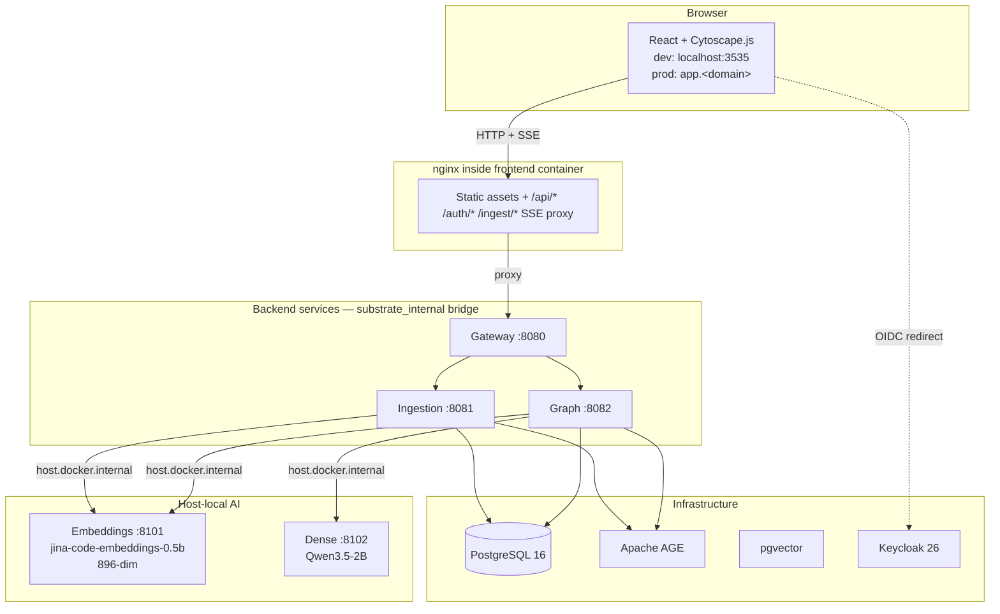
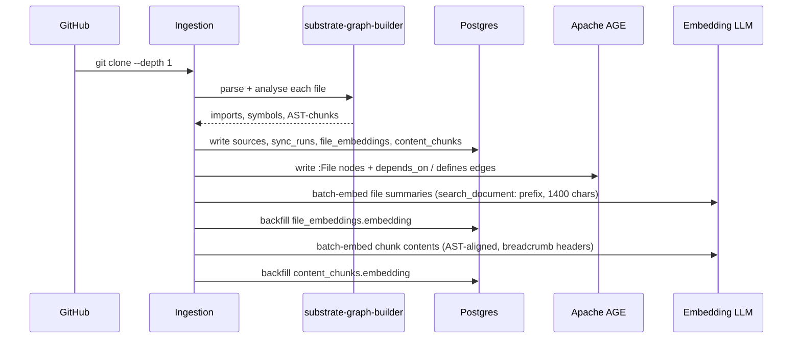
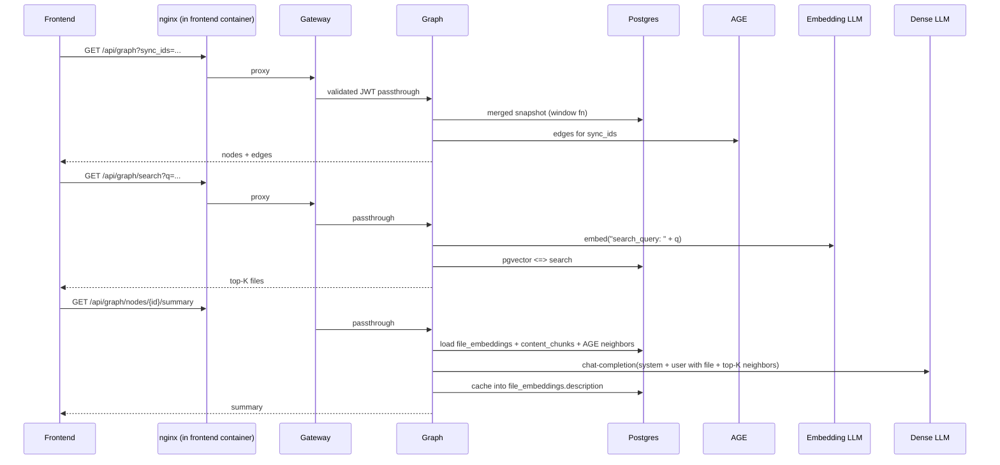
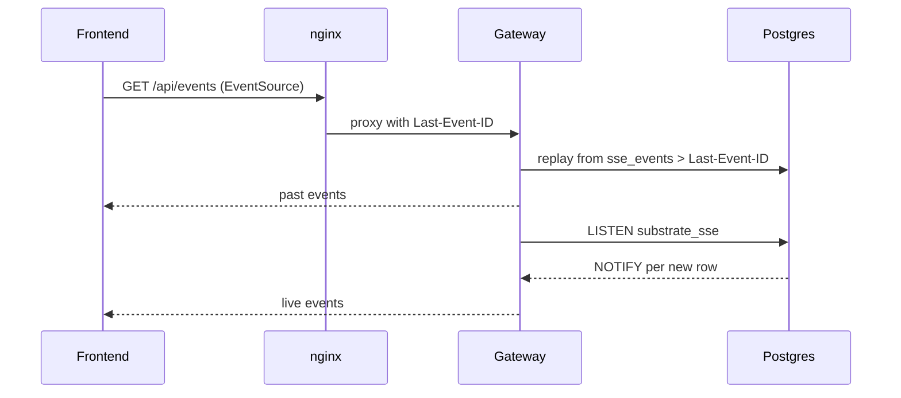

# Architecture

Substrate is a microservice monorepo that ingests source repositories, parses them with tree-sitter, materializes files + cross-file dependencies into PostgreSQL + Apache AGE + pgvector, and serves a read-only graph API + semantic search + cached LLM summaries.

---

## Architecture principles

1. **No mock data.** Every node and edge comes from real repository analysis.
2. **Stateless services.** Business logic services are stateless; all state lives in the single `substrate_graph` database.
3. **Single data boundary.** One Postgres instance with AGE + pgvector. No `substrate_ingestion`. No second DSN.
4. **Server-Sent Events only.** Server→client push uses `GET /api/events` (SSE) backed by Postgres `LISTEN/NOTIFY` + an `sse_events` replay table. WebSockets and client polling are banned; `make lint` fails if they appear in application code.
5. **Local AI.** All embeddings and dense LLM calls go to `lazy-lamacpp` on the host. No external AI APIs.
6. **AST-aware chunking.** Code chunks respect function/class boundaries via tree-sitter; markdown respects headings; text respects paragraphs.

---

## High-level architecture

In prod, home-stack's nginx-proxy-manager terminates TLS at `app.<domain>` / `auth.<domain>` / `pgadmin.<domain>` and forwards to `host.docker.internal:3535/8080/5050`. Substrate is unchanged between modes — only URLs in the active `.env.<mode>` file differ.

---

## Service overview

| Service | Host port | Container port | Purpose |
|---|---|---|---|
| **Frontend** | 3535 | 3000 | React dashboard served by nginx; proxies `/api`, `/auth`, `/ingest` to gateway |
| **Gateway** | 8180 (debug) | 8080 | JWT auth, HTTP proxy, SSE fan-out |
| **Ingestion** | 8181 (debug) | 8081 | GitHub connector, sync orchestration, AST chunking, embeddings |
| **Graph** | 8182 (debug) | 8082 | Graph queries, semantic search, enriched summaries |
| **Postgres** | 5432 | 5432 | Single DB: AGE + pgvector + relational |
| **Keycloak** | 8080 | 8080 | OIDC, JWT issuance, realm imported from template |
| **pgadmin** | 5050 | 80 | DB admin UI |

Host ports 8180/8181/8182 are for debug only — browsers reach `/api/*` through the frontend's nginx, never the gateway directly.

---

## Infrastructure components

| Component | Technology | Purpose |
|---|---|---|
| Primary DB | PostgreSQL 16 | Relational data, embeddings, graph topology |
| Graph extension | Apache AGE | Cypher inside Postgres — graph named `substrate` |
| Vector extension | pgvector | 896-dim file + chunk embeddings |
| Identity | Keycloak 26 | OIDC, JWT (RS256) |
| Embedding LLM | jina-code-embeddings-0.5b (GGUF Q8_0) | 896-dim, 32 k context |
| Dense LLM | Qwen3.5-2B (GGUF Q8_0) | Summaries, enrichment — 60 k context |
| LLM runtime | lazy-lamacpp | systemd-user-managed llama.cpp workers |
| Edge proxy (prod) | nginx-proxy-manager (home-stack) | TLS termination + hostname routing |

---

## Data flow

### Ingestion pipeline

### Query flow

### Realtime flow

---

## Deployment architecture

- Single `compose.yaml` at repo root, same file for dev and prod.
- Two env templates: `.env.local.example` (dev defaults) and `.env.prod.example` (prod template).
- `make up [MODE=local|prod]` renders the Keycloak realm from its template and brings up the stack.
- In prod, home-stack's NPM terminates TLS and proxies public hostnames to the host-published ports. Substrate doesn't run its own reverse proxy.

See [Deployment](deployment.md) for the full walk-through.

---

## Next steps

- [Architecture Overview](overview.md) — request flow, service boundaries, graph semantics
- [Data Model](data-model.md) — Postgres schema, AGE graph, embedding pipeline
- [Tech Stack](tech-stack.md) — concrete dependency set and versions
- [Deployment](deployment.md) — make targets, env files, NPM integration
