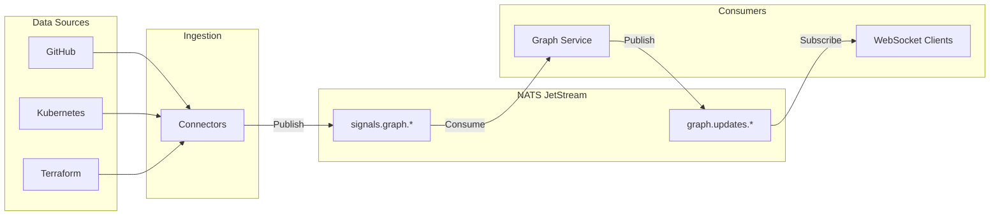

# Architecture Overview

## Design Philosophy

Substrate's architecture follows the principle of **continuous computable governance** — the system doesn't just observe your architecture, it actively maintains alignment between intent and reality.

---

## The Two Graph Layers

At the heart of Substrate are two graph layers that represent the duality of architectural knowledge:

### Intended Graph (G_I)
What **should** exist — the architectural intent captured from:
- Policies (Rego rules)
- ADRs (Architecture Decision Records)
- Golden paths and approved topology
- Declared infrastructure (Terraform, K8s manifests)

### Observed Graph (G_R)
What **actually** exists — the runtime reality captured from:
- Live code dependencies (GitHub, AST parsing)
- Running services (Kubernetes API)
- Deployed infrastructure (Terraform state)
- SSH-verified host state

### Drift = |G_I - G_R|

The drift score quantifies the divergence between intent and reality:

```
drift_score = (divergences + absences) / (convergences + divergences + absences)
```

| Term | Definition |
|------|------------|
| **Convergences** | Nodes/edges in both G_I and G_R |
| **Divergences** | Nodes/edges in G_R but not G_I (shadow IT, unauthorized changes) |
| **Absences** | Nodes/edges in G_I but not G_R (missing implementations, deprecated services) |

---

## Service Boundaries

### Gateway Service
**Single ingress point** for all external traffic.

- JWT validation via Keycloak JWKS
- Request routing to downstream services
- API key issuance for CI/CD integrations
- WebSocket upgrade handling
- Rate limiting via Redis token bucket

### Ingestion Service
**Connector hub** that translates external tool signals into normalized graph events.

| Connector | Data Source | Trigger |
|-----------|-------------|---------|
| GitHub | Repos, PRs, commits | Webhook / Poll |
| Kubernetes | Deployments, Services | API Watch |
| Terraform | State files | Post-apply hook |
| Jira | Tickets, sprints | Webhook |

Each connector:
1. Receives raw signal
2. Normalizes to `GraphEvent` schema
3. Publishes to NATS `signals.graph.*`
4. Stores audit trail in PostgreSQL

### Graph Service
**Graph brain** that maintains the live architecture graph.

**Core Functions:**
- Event consumption from NATS
- Neo4j graph maintenance (MERGE operations)
- Redis snapshot caching
- WebSocket delta broadcasting
- Drift score computation
- Policy evaluation via OPA
- Simulation engine (what-if analysis)

### RAG Orchestrator (SDB)
**Software-Defined Brain** for natural language interaction.

**RAG Pipelines:**
- **Standard RAG**: Factual queries about current graph state
- **Conversational RAG**: Multi-turn sessions with context
- **CRAG**: Corrective RAG for low-confidence retrievals

**Models (local):**
- Embedding: BGE-M3
- LLM: Llama 3.1 8B (or larger for enterprise)
- Reranking: bge-reranker-v2-m3

---

## Event-Driven Architecture



**Event Schema:**

```json
{
  "source": "github",
  "event_type": "pr_merge",
  "nodes_affected": [...],
  "edges_affected": [...],
  "timestamp": "2026-04-12T10:30:00Z"
}
```

---

## WebSocket Real-Time Protocol

The frontend maintains a persistent WebSocket connection for live updates:

**Connection:**
```
ws://gateway:8080/ws/graph?token=<JWT>
```

**Inbound Messages:**

```json
// Initial snapshot
{
  "type": "snapshot",
  "nodes": [...],
  "edges": [...],
  "seq": 1
}

// Delta batch
{
  "type": "batch",
  "events": [
    {"op": "node_added", "data": {...}},
    {"op": "edge_added", "data": {...}},
    {"op": "node_updated", "data": {...}}
  ],
  "seq": 42
}
```

**Outbound Messages:**

```json
{"type": "ack", "seq": 42}
{"type": "subscribe", "filters": {"domains": ["payments"]}}
```

---

## Security Architecture

### Authentication
- Keycloak OIDC with PKCE for SPAs
- JWT tokens with 5-minute access, 30-minute refresh
- JWKS validation cached in Gateway (5-min TTL)

### Authorization
- RBAC from JWT group claims
- Roles: admin, architect, developer, viewer, service-account
- OPA policies for fine-grained access decisions

### Data Protection
- All inter-service traffic over TLS
- mTLS for AI inference endpoints
- SSH Runtime Connector uses Vault-signed ephemeral certificates (5-min TTL)
- No source code or architecture data leaves the infrastructure

---

## Scalability Considerations

### Horizontal Scaling
- Gateway: Stateless, can run multiple instances behind load balancer
- Ingestion: Celery workers scale independently
- Graph Service: Single instance (Neo4j consistency), but read replicas possible

### Performance Targets

| Metric | Target | Notes |
|--------|--------|-------|
| Graph query | <100ms | 10K nodes |
| PR governance check | <2s | OPA evaluation + explanation |
| RAG response | <3s | Streaming starts <500ms |
| Simulation | <15s | Full policy re-evaluation |
| WebSocket delta | <100ms | From publish to render |

---

## Monitoring and Observability

### Structured Logging
All services output JSON logs:

```json
{
  "ts": "2026-04-12T14:23:01Z",
  "level": "info",
  "service": "graph-service",
  "event": "node_created",
  "node_id": "lib/newmodule",
  "source": "github",
  "duration_ms": 12
}
```

### Health Checks
Every service exposes `GET /health` with dependency checks.

### Metrics (Future)
- Prometheus for metrics collection
- Grafana for dashboards
- OpenTelemetry for distributed tracing
