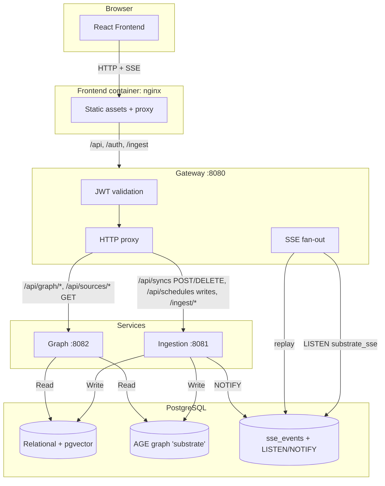
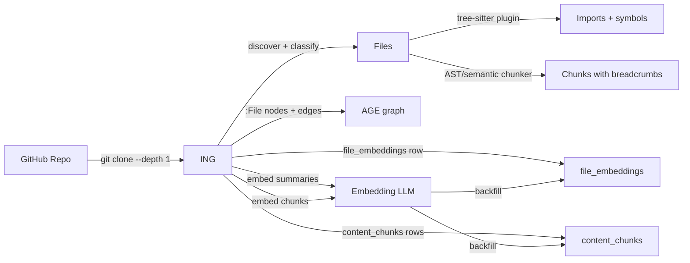

# Architecture Overview

## Design philosophy

Substrate's architecture is built around one principle: **the graph should always reflect reality**. Every node and edge is derived from actual source-code analysis — never from manually maintained diagrams.

---

## The two graph layers (future vision)

### Intended Graph (G_I)
What **should** exist — architectural intent captured from:
- Policies (Rego rules) — *planned*
- ADRs (Architecture Decision Records) — *planned*
- Approved topology and golden paths — *planned*
- Declared infrastructure — *planned*

### Observed Graph (G_R)
What **actually** exists — runtime reality captured from:
- Live code dependencies (GitHub, tree-sitter AST) — **implemented**
- Running services (Kubernetes API) — *planned*
- Deployed infrastructure (Terraform state) — *planned*

### Current implementation

Today, Substrate builds **G_R** from GitHub repositories. The ingestion pipeline:

1. Shallow-clones the target repository
2. Discovers and classifies every file
3. Parses imports via per-language `substrate-graph-builder` plugins (tree-sitter)
4. AST/semantic-chunks file contents; embeds each chunk with a contextual breadcrumb
5. Writes nodes and edges into PostgreSQL + Apache AGE
6. Serves the merged graph through a read-only REST API behind the Gateway

---

## Service boundaries

### Gateway service
**Single ingress point** for all API traffic after nginx.

- JWT validation via Keycloak JWKS (cached with 5-minute TTL, background refresh)
- Request routing to downstream services (`/api` → graph for reads, ingestion for sync mutations)
- **SSE fan-out** at `GET /api/events` — no WebSockets
- CORS configuration driven by `.env.<mode>`

Shared `httpx.AsyncClient` for connection pooling; app-level retry on idempotent methods with connection errors.

### Ingestion service
**Sync orchestrator** that transforms source code into graph data.

| Capability | Status |
|---|---|
| GitHub connector (shallow clone) | Implemented |
| File classification (source / config / doc / script / asset / …) | Implemented |
| Tree-sitter import extraction (15 languages via `substrate-graph-builder`) | Implemented |
| AST-aware chunking + semantic (markdown/text) + line-greedy fallback | Implemented |
| Embedding pipeline (file summaries + chunks, 896-dim) | Implemented |
| Sync scheduling (`sync_schedules`, poller) | Implemented |

Ingestion writes to the same `substrate_graph` database the graph service reads. No `substrate_ingestion` database, no message bus.

### Graph service
**Read-only query layer** over the code-knowledge graph.

- Serves merged graph snapshots across multiple syncs
- Semantic search via pgvector cosine distance over file-level embeddings
- **Enriched summary pipeline** — full file reconstruction + top-K edge neighbors → dense LLM → cached `file_embeddings.description`
- Source metadata CRUD (for connected repositories)
- Sync history + schedule reads (writes live in ingestion)

### Frontend
**React dashboard** for graph exploration and source management.

- Cytoscape.js canvas (WASM engine planned)
- OIDC via `react-oidc-context`
- Server state: TanStack Query; client state: Zustand
- Nginx inside the container proxies `/api`, `/auth`, `/ingest` to the gateway on the `substrate_internal` bridge

---

## Request flow



---

## Data flow: GitHub repository → graph



---

## Summary pipelines (two, clearly separate)

**Ingestion-side file summary** — cheap, embedded once at sync time:
- Template: `"path: <p>\ntype: <t>\nlanguage: <l>\n\n<first 100 lines>"`
- Prefixed with `search_document: `, truncated to 1400 chars, sent to embedding LLM
- 896-dim vector stored in `file_embeddings.embedding`
- Never stored as text

**Graph-side enriched summary** — on-demand via `GET /api/graph/nodes/{id}/summary`:
- Full file reconstructed from `content_chunks` (line-overlap dedup, cap 5 MB)
- Top-K edge neighbors (`summary_edge_neighbors=10`) ranked by cosine similarity of file embeddings
- Each neighbor's first 8 lines + cached description attached
- Total prompt budget: 100 000 chars (88 % file, 10 % neighbors); context-overflow retries at 0.5× then 0.25× budget
- Dense LLM call (`temperature=0.2`, `max_tokens=400`, `enable_thinking=false`)
- Result cached in `file_embeddings.description` + `description_generated_at`
- Never embedded — this is English text for humans

---

## Security architecture

### Authentication
- Keycloak OIDC with PKCE for the SPA
- JWT access tokens (RS256) validated by the Gateway
- JWKS fetched with 5-minute TTL cache and stale-while-revalidate refresh
- `verify_aud=False` at the gateway (audience not enforced today)

### Authorization
- Currently: authentication only. No RBAC.
- Fine-grained RBAC and OPA policy evaluation are planned.

### Data protection
- All source analysis happens locally on host
- No repository data leaves the infrastructure
- Embeddings and dense summaries generated by local llama.cpp servers
- Prod: TLS handled upstream by home-stack NPM (Let's Encrypt)

---

## Scalability

### Current scaling characteristics

| Component | Approach |
|---|---|
| Gateway | Stateless; can run multiple instances behind a load balancer |
| Ingestion | Single scheduler + runner; syncs processed sequentially per source |
| Graph | Stateless; horizontally scalable |
| PostgreSQL | Vertical; read replicas possible |

### Performance targets (current)

| Metric | Target | Notes |
|---|---|---|
| Graph query | < 500 ms | Depends on snapshot size + AGE query complexity |
| Sync completion | Minutes | Varies with repo size |
| Search | < 1 s | Embed query → pgvector cosine search |
| Enriched summary | 5-60 s | Dense LLM call; file + neighbors prefill dominates |

---

## Monitoring and observability

### Structured logging
All services emit JSON via `structlog`:

```json
{
  "timestamp": "2026-04-20T14:23:01Z",
  "level": "info",
  "service": "graph",
  "event": "snapshot_query",
  "sync_count": 2,
  "node_count": 150,
  "duration_ms": 45
}
```

4xx responses log at `info`; 5xx at `error`.

### Health checks
Every service exposes `GET /health` → `{"status":"ok"}`.

### `make doctor`
Probes each layer (Postgres, AGE, Keycloak, pgadmin, LLM endpoints, service `/health`s) and prints PASS/FAIL per probe. 15 probes in the current set.
