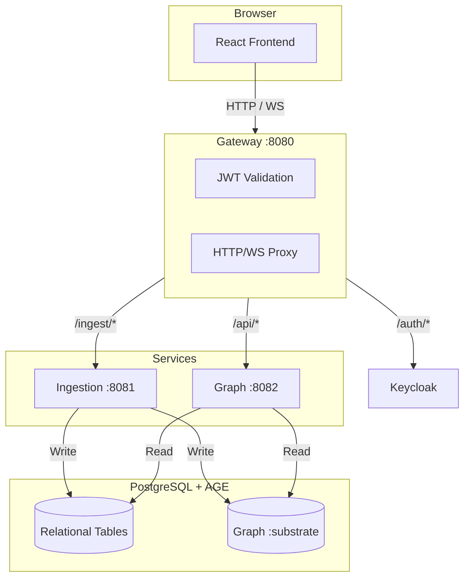
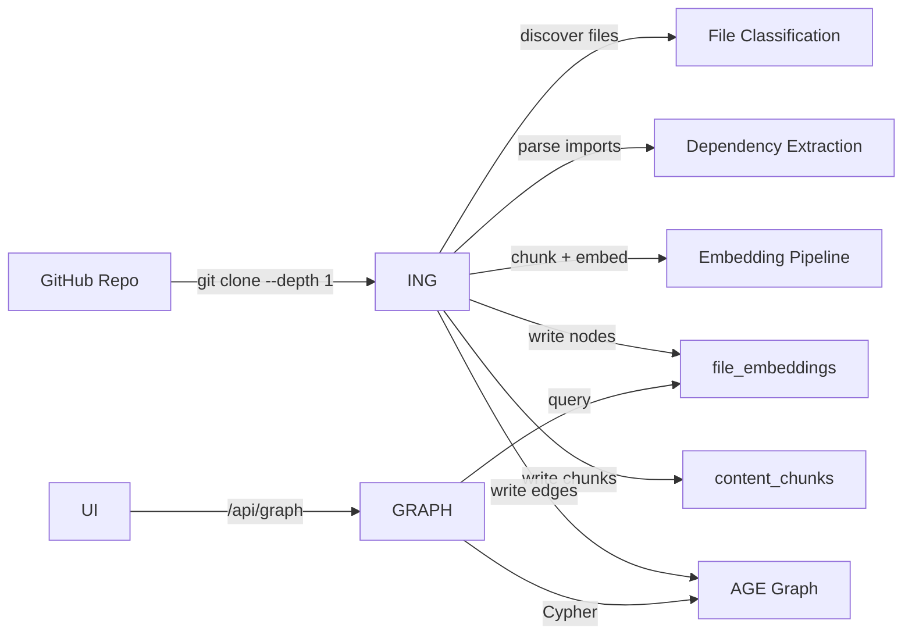

# Architecture Overview

## Design Philosophy

Substrate's architecture is built around a single principle: **the graph should always reflect reality**. Every node and edge is derived from actual source code analysis, not manually maintained diagrams.

---

## The Two Graph Layers (Future Vision)

At the heart of Substrate's long-term design are two graph layers:

### Intended Graph (G_I)
What **should** exist — the architectural intent captured from:
- Policies (Rego rules) — *planned*
- ADRs (Architecture Decision Records) — *planned*
- Approved topology and golden paths — *planned*
- Declared infrastructure — *planned*

### Observed Graph (G_R)
What **actually** exists — the runtime reality captured from:
- Live code dependencies (GitHub, AST parsing) — **implemented**
- Running services (Kubernetes API) — *planned*
- Deployed infrastructure (Terraform state) — *planned*

### Current Implementation

Today, Substrate builds **G_R** from GitHub repositories. The ingestion pipeline:

1. Shallow-clones the target repository
2. Discovers and classifies every file
3. Parses imports/includes to extract cross-file dependencies
4. Chunks file contents and generates embeddings
5. Writes nodes and edges into PostgreSQL + Apache AGE
6. Serves the merged graph through a read-only REST API

---

## Service Boundaries

### Gateway Service
**Single ingress point** for all external traffic.

- JWT validation via Keycloak JWKS (cached with TTL-based refresh)
- Request routing to downstream services
- WebSocket upgrade handling and proxying
- CORS configuration for frontend origins

The gateway uses a shared `httpx.AsyncClient` for connection pooling and implements app-level retries for idempotent methods.

### Ingestion Service
**Sync orchestrator** that transforms source code into graph data.

| Capability | Status |
|------------|--------|
| GitHub connector (clone-based) | Implemented |
| File classification (source, config, doc, etc.) | Implemented |
| Import parsing (C, Python, JS/TS, Go, Rust, etc.) | Implemented |
| Chunking + embedding pipeline | Implemented |
| Sync scheduling | Implemented |
| Kubernetes connector | Planned |
| Terraform connector | Planned |
| Jira connector | Planned |

The ingestion service directly writes to the shared PostgreSQL/AGE database. There is no message bus in the current implementation.

### Graph Service
**Read-only query layer** over the architecture graph.

- Serves merged graph snapshots across multiple syncs
- Provides semantic search via pgvector cosine similarity
- Generates on-demand LLM summaries for individual files
- Manages source metadata (CRUD for connected repositories)
- Reads sync history and scheduling info (writes live in ingestion)

### Frontend
**React dashboard** for graph exploration and source management.

- Cytoscape.js-based graph canvas (currently; WASM engine planned)
- OIDC authentication via Keycloak
- Server state managed with TanStack Query
- Client state managed with Zustand

---

## Request Flow



---

## Data Flow: GitHub Repository to Graph



---

## Security Architecture

### Authentication
- Keycloak OIDC with PKCE for the SPA frontend
- JWT access tokens (RS256) validated by the Gateway
- JWKS fetched from Keycloak with 5-minute TTL caching

### Authorization
- Currently: authentication only at the Gateway
- Fine-grained RBAC and OPA policy evaluation are planned for future phases

### Data Protection
- All source code analysis happens locally
- No repository data leaves the infrastructure
- Embeddings generated by local llama.cpp servers

---

## Scalability Considerations

### Current Scaling Characteristics

| Component | Scaling Approach |
|-----------|-----------------|
| Gateway | Stateless; can run multiple instances behind a load balancer |
| Ingestion | Single scheduler + runner; syncs are processed sequentially per source |
| Graph Service | Stateless read-only API; horizontally scalable |
| PostgreSQL | Vertical scaling; read replicas possible |

### Performance Targets (Current)

| Metric | Target | Notes |
|--------|--------|-------|
| Graph query | <500ms | Depends on snapshot size and AGE query complexity |
| Sync completion | Minutes | Varies with repository size |
| Search response | <1s | Vector similarity over pgvector |
| Summary generation | <10s | Local dense LLM call |

---

## Monitoring and Observability

### Structured Logging
All services output JSON logs via `structlog`:

```json
{
  "timestamp": "2026-04-12T14:23:01Z",
  "level": "info",
  "service": "graph-service",
  "event": "snapshot_query",
  "sync_count": 2,
  "node_count": 150,
  "duration_ms": 45
}
```

### Health Checks
Every service exposes `GET /health` returning `{"status": "ok"}`.
