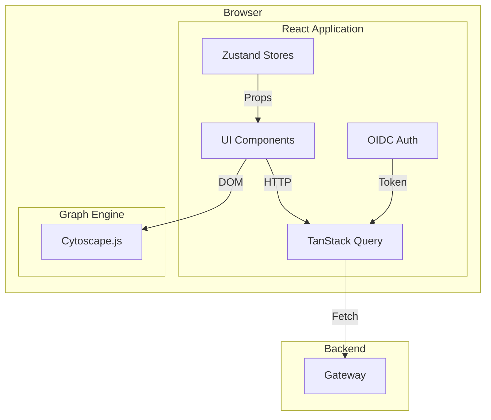

# Frontend

**Host port:** 3535 (container listens on 3000)
**Stack:** React 19 + TypeScript 5 + Vite 6
**Repository:** `apps/frontend/`

---

## Overview

The Frontend is a React-based dashboard that provides the governance workbench interface. It renders architecture graphs using Cytoscape.js, manages source connections, and provides semantic search over the codebase.

---

## Architecture



---

## Tech Stack

| Layer | Technology | Purpose |
|-------|------------|---------|
| Framework | React 19.2.4 | UI framework |
| Language | TypeScript 5 | Type safety |
| Build Tool | Vite 6 | Dev server, bundling |
| Routing | react-router-dom | Client-side routing |
| Styling | CSS custom properties + Tailwind | Theming and utilities |
| State | Zustand 5 | Client state |
| Data | TanStack Query 5 | Server state, caching |
| Auth | react-oidc-context + oidc-client-ts | OIDC integration |
| Graph | Cytoscape.js | Graph rendering |
| UI Primitives | @base-ui/react | Headless dialog, select |
| Icons | lucide-react | Iconography |
| Testing | Vitest + @testing-library/react | Unit/component tests |

---

## Directory Structure

```
apps/frontend/src/
├── components/
│   ├── graph/
│   │   ├── GraphCanvas.tsx         # Main graph container + Cytoscape init
│   │   ├── FilterPanel.tsx         # Node/layer filters (not currently mounted)
│   │   ├── SignalsOverlay.tsx      # Live signal feed
│   │   ├── DynamicLegend.tsx       # Interactive type legend
│   │   └── ViolationBadge.tsx      # Violation indicator
│   ├── layout/
│   │   ├── DashboardLayout.tsx     # Shell layout, mounts global hooks
│   │   ├── Sidebar.tsx             # Icon navigation rail
│   │   ├── TopBar.tsx              # Brand, search, stats, health
│   │   └── MobileNav.tsx           # Bottom tab bar (mobile)
│   ├── modals/
│   │   ├── ModalRoot.tsx           # Routes active modal
│   │   ├── SourcesModal.tsx        # Source + sync management
│   │   ├── GraphModal.tsx          # Graph config (Leiden tuning)
│   │   ├── SearchModal.tsx         # Semantic search
│   │   ├── UserModal.tsx           # Account + settings
│   │   ├── EnrichmentModal.tsx     # Placeholder / info modal
│   │   └── sources/                # Sources modal sub-components
│   │       ├── SourcesSidebar.tsx
│   │       ├── SourceDetailPane.tsx
│   │       ├── SnapshotList.tsx
│   │       ├── SnapshotRow.tsx
│   │       ├── SnapshotRowSummary.tsx
│   │       ├── SnapshotIssuesInline.tsx
│   │       ├── AddSourceInput.tsx
│   │       ├── ScheduleStrip.tsx
│   │       ├── DetailHeader.tsx
│   │       ├── SourceListItem.tsx
│   │       └── UnifiedToolbar.tsx
│   ├── panels/
│   │   └── NodeDetailPanel.tsx     # Right-panel node metadata
│   └── ui/                         # Shared UI primitives
│       ├── Modal.tsx
│       ├── dialog.tsx
│       ├── input.tsx
│       ├── button.tsx
│       ├── badge.tsx
│       ├── label.tsx
│       └── select.tsx
├── hooks/
│   ├── useSources.ts               # Source queries + mutations
│   ├── useSyncs.ts                 # Central sync poller + mutations
│   ├── useSourceSyncs.ts           # Infinite sync history for a source
│   ├── useSyncIssues.ts            # Sync issue fetching
│   ├── useSchedules.ts             # Schedule queries + mutations
│   ├── useSearch.ts                # Semantic search hook
│   └── useResponsive.ts            # Desktop/mobile breakpoint
├── lib/
│   ├── api.ts                      # API client wrapper
│   ├── auth.ts                     # OIDC configuration
│   ├── logger.ts                   # Structured logging helper
│   ├── utils.ts                    # General utilities
│   └── cytoscapeLoader.ts          # Dynamic Cytoscape import
├── pages/
│   ├── GraphPage.tsx               # Main graph view
│   └── CallbackPage.tsx            # OIDC callback handler
├── stores/
│   ├── graph.ts                    # Graph runtime state
│   ├── ui.ts                       # UI chrome state
│   ├── theme.ts                    # Dark/light theme (persisted)
│   └── syncSet.ts                  # Active snapshot set (persisted)
├── main.tsx                        # Entry point
├── App.tsx                         # Root component + router
└── router.tsx                      # (unused) router definition
```

---

## Component Hierarchy

```
main.tsx
└── AuthProvider (react-oidc-context)
    └── QueryClientProvider (TanStack Query)
        └── BrowserRouter
            └── App
                └── Routes
                    └── /callback -> CallbackPage
                    └── / -> RequireAuth -> DashboardLayout
                         ├── TopBar
                         ├── Sidebar (desktop)
                         ├── MobileNav (mobile)
                         ├── ModalRoot (active modal only)
                         ├── SwapToast (auto-swap notification)
                         └── Outlet -> GraphPage
                              ├── GraphCanvas
                              │    ├── Cytoscape instance
                              │    ├── DynamicLegend
                              │    ├── SignalsOverlay
                              │    └── ViolationBadge
                              └── NodeDetailPanel (when node selected)
```

---

## State Management

### Graph Store (`stores/graph.ts`)

Zustand store for graph runtime state:

```typescript
interface GraphState {
  // Data
  nodes: GraphNode[];
  edges: GraphEdge[];
  signals: GraphSignal[];
  violations: GraphViolation[];

  // Selection
  selectedNodeId: string | null;
  selectedNodeData: Record<string, unknown> | null;
  selectNode: (id: string | null, data?: Record<string, unknown>) => void;
  setSelectedNodeId: (id: string | null) => void;

  // Filters
  filters: { types: Set<string>; layers: string[] };
  toggleTypeFilter: (type: string) => void;
  setFilters: (filters: GraphFilters) => void;
  resetFilters: () => void;

  // Layout
  layout: 'force' | 'hierarchical';
  setLayout: (layout: 'force' | 'hierarchical') => void;
  layoutName: string;
  setLayoutName: (name: string) => void;

  // Viewport
  zoom: number;
  setZoom: (z: number) => void;
  pan: { x: number; y: number };
  setPan: (p: { x: number; y: number }) => void;
  nodeSize: number;
  setNodeSize: (size: number) => void;

  // Stats / status
  stats: GraphStats; // { nodeCount, edgeCount, violationCount, lastUpdated: string }
  setStats: (stats: GraphStats) => void;
  connectionStatus: 'connected' | 'disconnected' | 'reconnecting';
  setConnectionStatus: (status: 'connected' | 'disconnected' | 'reconnecting') => void;
  searchQuery: string;
  setSearchQuery: (query: string) => void;
  syncStatus: 'idle' | 'syncing' | 'error';
  setSyncStatus: (status: 'idle' | 'syncing' | 'error') => void;
  syncProgress: { done: number; total: number } | null;
  setSyncProgress: (progress: { done: number; total: number } | null) => void;
  lastLoadMs: number | null;
  lastServerMs: number | null;

  // Canvas lifecycle
  canvasCleared: boolean;
  setCanvasCleared: (v: boolean) => void;
  clearCanvas: () => void;

  // Config
  graphConfig: GraphConfig;
  setGraphConfig: (next: Partial<GraphConfig>) => void;
  setLeidenConfig: (next: Partial<GraphConfig['leiden']>) => void;
  resetGraphConfig: () => void;

  // Data loading
  fetchGraph: (token?: string, syncIds?: string[]) => Promise<void>;
}
```

**Auto-refetch behavior:** The store subscribes to `syncSetStore` and automatically calls `fetchGraph` (debounced 200ms) whenever the active snapshot set changes.

### UI Store (`stores/ui.ts`)

```typescript
interface UIState {
  sidebarOpen: boolean;
  activeModal: ModalName;
  openModal: (modal: ModalName) => void;
  closeModal: () => void;
  toggleSidebar: () => void;
  setSidebarOpen: (open: boolean) => void;
  defaultRepoUrl: string | null;
  setDefaultRepoUrl: (url: string | null) => void;
  sourcesModalTarget: { sourceId: string; expandSyncId: string | null } | null;
  setSourcesModalTarget: (target: ...) => void;
}
```

### Sync Set Store (`stores/syncSet.ts`)

Persisted to `localStorage`:

```typescript
interface SyncSetState {
  syncIds: string[];
  hasInitialized: boolean;
  pendingSwap: PendingSwap | null;
  sourceMap: Map<string, string>; // syncId -> sourceId

  load: (syncId: string) => void;
  unload: (syncId: string) => void;
  setActiveSet: (ids: string[]) => void;
  onSyncCompleted: (run: SyncRunSummary, sourceLabel: string) => void;
  undoSwap: () => void;
  pruneInvalid: (validSyncIds: Set<string>) => void;
  registerSourceMap: (m: Map<string, string>) => void;
  initializeIfNeeded: (token?: string) => Promise<void>;
}
```

**Auto-swap:** When a running sync completes for a source that is already loaded, the old snapshot is automatically replaced with the new one, and a `SwapToast` appears with an undo button.

### Theme Store (`stores/theme.ts`)

Persisted to `localStorage`. Default theme is **`light`**.

Applies `data-theme`, `.dark`/`.light` classes, and `color-scheme` to `<html>` immediately on load and on hydration to prevent flash.

---

## Authentication

### OIDC Configuration (`lib/auth.ts`)

```typescript
const oidcConfig = {
  authority: `${import.meta.env.VITE_KEYCLOAK_URL}/realms/${import.meta.env.VITE_KEYCLOAK_REALM}`,
  client_id: import.meta.env.VITE_KEYCLOAK_CLIENT_ID,
  redirect_uri: `${window.location.origin}/callback`,
  scope: 'openid profile email',
  automaticSilentRenew: true,
  userStore: new WebStorageStateStore({ store: window.sessionStorage })
};
```

### Auth Flow

1. No token → `react-oidc-context` redirects to Keycloak
2. Keycloak authenticates → redirects with auth code
3. Code exchanged for access_token + refresh_token
4. Tokens stored in `sessionStorage`
5. Silent refresh before expiry
6. `App.tsx` exposes token on `window.__authToken` for the graph store subscriber

---

## Graph Canvas (`GraphCanvas.tsx`)

### Cytoscape Configuration

- Performance flags: `textureOnViewport: true`, `hideEdgesOnViewport: true`, `pixelRatio: 1`
- Nodes grouped by `source_id` into compound parent nodes (`src:<id>`)
- Layout: `cose` (force-directed) by default
- Fallback to `grid` layout when filtered node count > 200 to avoid UI freezes

### Keyboard Shortcuts

| Key | Action |
|-----|--------|
| `Ctrl/Cmd + 0` | Fit graph to viewport |
| `Ctrl/Cmd + +` | Zoom in |
| `Ctrl/Cmd + -` | Zoom out |
| `Escape` | Deselect node, close modal |
| `L` | Relayout graph |

### One-Way Viewport Flow

Zoom/pan events in Cytoscape write *to* the Zustand store, but the store never writes *back* to Cytoscape. This prevents feedback loops.

---

## Custom Hooks

| Hook | Purpose |
|------|---------|
| `useSources` | Query `/api/sources`, mutate `createSource` / `purgeSource` |
| `useSyncs` | **Central poller** — queries active syncs every 5s when running, 30s otherwise. Detects completions and triggers auto-swap. Also exposes `startSync`, `cancelSync`, `retrySync`, `cleanSync`, and `purgeSync` mutations. |
| `useSourceSyncs` | Infinite query for a source's sync history (`/api/syncs?source_id=...`) |
| `useSyncIssues` | Fetches issues for a sync (`/api/syncs/{id}/issues`) |
| `useSchedules` | Queries and mutates sync schedules |
| `useSearch` | Wraps `/api/graph/search` with local result state |
| `useResponsive` | Returns `{ isDesktop, isMobile }` based on 1024px breakpoint |

---

## Modal System

`ModalRoot.tsx` mounts **only the active modal**. This prevents unrelated data hooks from running in the background.

| Modal | Purpose |
|-------|---------|
| `sources` | Source management, sync history, scheduling |
| `graph` | Graph configuration (Leiden communities) |
| `search` | Semantic search interface |
| `user` | Account info and theme settings |
| `enrichment` | Info about inline enrichment |
| `policies` | Coming soon — policy engine |
| `adrs` | Coming soon — ADR / WHY layer |
| `drift` | Coming soon — drift detection |
| `query` | Coming soon — natural language query |
| `nodeDetail` | **Not mounted in `ModalRoot`** — handled inline by `GraphPage` as a slide-over panel |

---

## API Layer (`lib/api.ts`)

```typescript
export async function apiFetch<T>(
  path: string,
  token?: string,
  options?: RequestInit
): Promise<T>
```

- Injects `Authorization: Bearer <token>`
- Logs request start, duration, and outcome via `lib/logger.ts`
- Throws on non-OK responses

All API calls use **relative paths**:
- `/api/*` → Gateway → Graph Service
- `/ingest/*` → Gateway → Ingestion Service
- `/auth/*` → Gateway → Keycloak

### In-container nginx proxy

Inside `substrate-frontend`, nginx serves the static bundle and proxies API traffic to the gateway via **container DNS** on the `substrate_internal` bridge — not `host.docker.internal`.

| Location | Upstream |
|---|---|
| `/api/` | `http://gateway:8080/api/` |
| `/jobs` | `http://gateway:8080` |
| `/ingest/` | `http://gateway:8080/ingest/` |
| `/auth/` | `http://gateway:8080/auth/` |
| `/health` | Returns `200 healthy` |

`/api/events` (SSE) flows through `/api/` → `gateway:8080/api/events` — the nginx block includes `proxy_read_timeout 86400` and `proxy_buffering off` semantics via the `proxy_set_header Upgrade` / `Connection: upgrade` pair, which works for SSE as well as any future HTTP streaming. There is no WebSocket path.

MkDocs is served by the dedicated `substrate-docs` nginx container on host port `8190`, with `home-stack` nginx-proxy-manager publishing it at `https://docs.invariantcontinuum.io`.

### Production

In prod, home-stack's nginx-proxy-manager (NPM) is the TLS termination + hostname router in front of everything. NPM reaches the frontend container via `host.docker.internal:3535` on the host. Substrate publishes the same ports in dev and prod — mode switching is purely in `.env.<mode>` URL values + realm rendering.

---

## Performance Optimizations

- **Modal isolation**: Only the active modal renders
- **Sync polling at layout level**: `useSyncs()` runs in `DashboardLayout`, not inside modals
- **React Query caching**: `staleTime: 30_000` default
- **Graph performance guardrails**: Falls back to `grid` layout for large graphs (>200 nodes)
- **Dynamic imports**: Cytoscape is loaded lazily via `lib/cytoscapeLoader.ts`

---

## Build Configuration

### Vite Config

```typescript
// vite.config.ts
import { defineConfig } from 'vite';
import react from '@vitejs/plugin-react';

export default defineConfig({
  plugins: [react()],
  server: {
    port: 5173,
    proxy: {
      // Vite dev-server (`pnpm dev`) proxies API paths to the host-
      // published gateway. SSE at /api/events is carried over this
      // same proxy — no special WebSocket config needed.
      '/api':    { target: 'http://localhost:8180', changeOrigin: true },
      '/ingest': { target: 'http://localhost:8180', changeOrigin: true },
      '/auth':   { target: 'http://localhost:8180', changeOrigin: true },
    },
  },
});
```

For the containerized build (`make up`), build-time Vite env vars (`VITE_KEYCLOAK_URL`, `VITE_KEYCLOAK_REALM`, `VITE_KEYCLOAK_CLIENT_ID`) are passed as Docker build args from the active `.env.<mode>` file via `compose.yaml`'s `frontend.build.args` block. The Dockerfile requires them to be set — an unbranded build exits with an error rather than silently baking wrong URLs.

---

## Testing

| Test File | Coverage |
|-----------|----------|
| `syncSet.test.ts` | Sync set store logic, auto-swap, undo |
| `useSyncs.test.ts` | Sync polling hook behavior |
| `ScheduleStrip.test.tsx` | Schedule display component |
| `SnapshotRow.test.tsx` | Snapshot row rendering |

Run tests with:
```bash
npm run test        # Vitest watch mode
npm run test:run    # Single run
```
