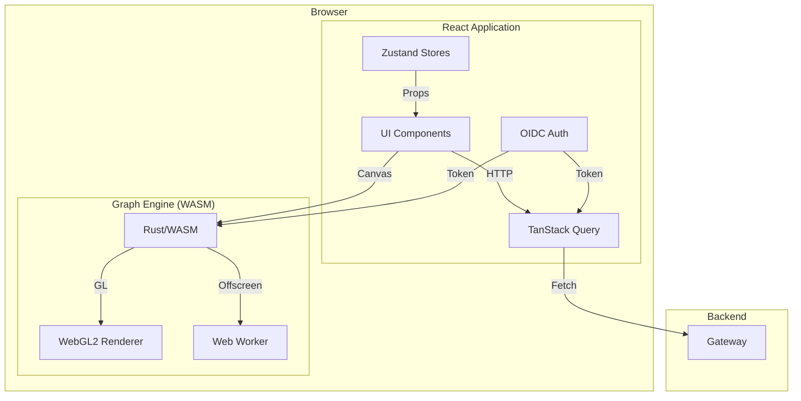

# Frontend

**Port:** 3000  
**Stack:** React 19 + TypeScript 5 + Vite + Tailwind CSS v4  
**Repository:** `frontend/`

---

## Overview

The Frontend is a React-based dashboard that provides the governance workbench interface. It features a custom WASM/WebGL graph engine for hardware-accelerated visualization of architecture graphs.

---

## Architecture



---

## Tech Stack

| Layer | Technology | Purpose |
|-------|------------|---------|
| Framework | React 19 | UI framework |
| Language | TypeScript 5 | Type safety |
| Build Tool | Vite 6 | Dev server, bundling |
| Styling | Tailwind CSS v4 | Utility-first CSS |
| State | Zustand 5 | Client state |
| Data | TanStack Query 5 | Server state, caching |
| Auth | react-oidc-context | OIDC integration |
| Animation | Framer Motion 12 | Transitions |
| Graph | @invariantcontinuum/graph | WASM graph engine |

---

## Directory Structure

```
frontend/src/
├── components/
│   ├── graph/
│   │   ├── GraphCanvas.tsx      # Main graph container
│   │   ├── FilterPanel.tsx      # Node type filters
│   │   ├── NodeDetailPanel.tsx  # Selected node details
│   │   ├── SignalsOverlay.tsx   # Live signal feed
│   │   ├── DynamicLegend.tsx    # Type legend
│   │   └── ViolationBadge.tsx   # Violation indicator
│   ├── layout/
│   │   ├── DashboardLayout.tsx  # Shell layout
│   │   ├── Sidebar.tsx          # Icon navigation
│   │   ├── TopBar.tsx           # Controls, search
│   │   └── MobileNav.tsx        # Mobile navigation
│   ├── modals/
│   │   ├── SourcesModal.tsx     # GitHub source config
│   │   ├── SearchModal.tsx      # Global search
│   │   └── SettingsModal.tsx    # User settings
│   └── ui/                      # shadcn/ui components
├── hooks/
│   ├── useJobs.ts               # Job management
│   ├── useSearch.ts             # Search functionality
│   └── useResponsive.ts         # Responsive breakpoints
├── lib/
│   ├── api.ts                   # API client
│   ├── auth.ts                  # Auth helpers
│   └── utils.ts                 # Utilities
├── pages/
│   ├── GraphPage.tsx            # Main graph view
│   └── CallbackPage.tsx         # OIDC callback
├── stores/
│   ├── graph.ts                 # Graph state
│   ├── ui.ts                    # UI state
│   └── theme.ts                 # Theme state
├── main.tsx                     # Entry point
└── App.tsx                      # Root component
```

---

## Component Hierarchy

```
App
├── AuthProvider (react-oidc-context)
├── QueryClientProvider (TanStack Query)
└── DashboardLayout
     ├── Sidebar
     ├── TopBar
     │    ├── Repo URL input
     │    ├── Sync button
     │    ├── Schedule dropdown
     │    ├── Search bar
     │    └── Stats display
     └── GraphPage
          ├── GraphCanvas
          │    ├── Graph (WASM)
          │    ├── SignalsOverlay
          │    ├── ViolationBadge
          │    └── DynamicLegend
          └── NodeDetailPanel
```

---

## Graph Engine Integration

### WASM Package

```bash
npm install @invariantcontinuum/graph
```

### React Wrapper

```tsx
import { Graph } from '@invariantcontinuum/graph/react';

function GraphCanvas() {
  const { data: snapshot } = useQuery({
    queryKey: ['graph'],
    queryFn: fetchGraph
  });

  return (
    <Graph
      snapshot={snapshot}
      wsUrl="ws://localhost:8080/ws/graph"
      authToken={token}
      layout="force"
      onNodeClick={handleNodeClick}
      onStatsChange={setStats}
      onLegendChange={setLegend}
    />
  );
}
```

### Graph Props

| Prop | Type | Description |
|------|------|-------------|
| `snapshot` | GraphSnapshot | Initial node/edge data |
| `wsUrl` | string | WebSocket endpoint |
| `authToken` | string | JWT for auth |
| `layout` | 'force' \| 'hierarchical' | Layout algorithm |
| `filter` | GraphFilter | Type/domain filters |
| `onNodeClick` | (node) => void | Click handler |
| `onStatsChange` | (stats) => void | Stats update handler |
| `onLegendChange` | (legend) => void | Legend update handler |

---

## State Management

### Graph Store (Zustand)

```typescript
interface GraphState {
  // Selection
  selectedNodeId: string | null;
  selectedNodeData: NodeData | null;
  
  // Filters
  filters: {
    types: Set<string>;
    domains: Set<string>;
    status: Set<string>;
  };
  
  // Layout
  layout: 'force' | 'hierarchical';
  
  // Stats
  stats: GraphStats;
  
  // Canvas state
  canvasCleared: boolean;
  
  // Actions
  selectNode: (id: string | null, data?: NodeData) => void;
  setFilter: (key: string, values: Set<string>) => void;
  setLayout: (layout: 'force' | 'hierarchical') => void;
  clearCanvas: () => void;
}
```

### UI Store (Zustand)

```typescript
interface UIState {
  // Modals
  activeModal: string | null;
  openModal: (name: string) => void;
  closeModal: () => void;
  
  // Theme
  theme: 'dark' | 'light';
  setTheme: (theme: 'dark' | 'light') => void;
  
  // Default repo for SourcesModal
  defaultRepoUrl: string | null;
}
```

---

## Authentication

### OIDC Configuration

```typescript
const oidcConfig = {
  authority: 'http://localhost:8080/auth/realms/substrate',
  client_id: 'substrate-frontend',
  redirect_uri: 'http://localhost:3000/callback',
  scope: 'openid profile email',
  automaticSilentRenew: true
};
```

### Auth Flow

1. No token → redirect to Keycloak
2. Keycloak authenticates → redirects with auth code
3. Exchange code for access_token (5min) + refresh_token (30min)
4. Tokens stored in sessionStorage
5. Silent refresh before expiry

---

## Real-Time Updates

### WebSocket Connection

```
ws://gateway:8080/ws/graph?token=<JWT>
```

### Delta Handling

The WASM engine handles deltas internally:
- `node_added` → Fade in animation
- `edge_added` → Fade in with delay
- `node_updated` → Update properties
- `node_removed` → Fade out

### Signals Overlay

Live feed of system events:
- Job lifecycle (sync started, progress, complete)
- WebSocket deltas (N nodes added)
- Future: policy evaluations, violations

---

## Design System

### Colors

| Token | Value | Usage |
|-------|-------|-------|
| `bg-primary` | `#060608` | Page background |
| `bg-surface` | `#0d0d12` | Card surfaces |
| `bg-elevated` | `#13131a` | Elevated elements |
| `text-primary` | `#f0f0f5` | Primary text |
| `text-secondary` | `#8888a0` | Secondary text |
| `accent-indigo` | `#6366f1` | Primary accent |
| `success` | `#10b981` | Success states |
| `warning` | `#f59e0b` | Warning states |
| `error` | `#ef4444` | Error states |

### Typography

| Element | Font | Size |
|---------|------|------|
| UI | Inter | 14px base |
| Code | JetBrains Mono | 13px |
| Graph Labels | Inter | 11px |

---

## Performance

### Optimizations

- WASM runs in Web Worker (off main thread)
- WebGL instanced rendering (1 draw call per shape type)
- Viewport culling (only visible nodes rendered)
- React Query caching (stale-while-revalidate)
- Lazy loading for modals

### Targets

| Metric | Target |
|--------|--------|
| First Contentful Paint | <1.5s |
| Time to Interactive | <3s |
| Graph render (10K nodes) | 60fps |
| Memory usage | <500MB |

---

## Build Configuration

### Vite Config

```typescript
// vite.config.ts
import { defineConfig } from 'vite';
import react from '@vitejs/plugin-react';
import wasm from 'vite-plugin-wasm';

export default defineConfig({
  plugins: [react(), wasm()],
  optimizeDeps: {
    exclude: ['@invariantcontinuum/graph']
  },
  server: {
    port: 3000,
    proxy: {
      '/api': 'http://localhost:8080',
      '/ws': {
        target: 'ws://localhost:8080',
        ws: true
      }
    }
  }
});
```
