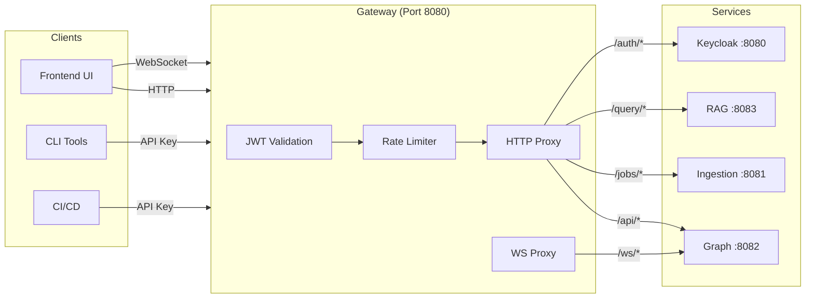

# Gateway Service

**Port:** 8080  
**Language:** Python 3.12 / FastAPI  
**Repository:** `services/gateway/`

---

## Overview

The Gateway is the **single ingress point** for all external traffic. It handles:

- JWT authentication and validation
- Request routing to downstream services
- WebSocket proxying for real-time updates
- Rate limiting
- API key management for CI/CD integrations

---

## Architecture



---

## Authentication Flow

### JWT Validation

1. Extract Bearer token from `Authorization` header
2. Decode JWT header to get `kid` (key ID)
3. Fetch JWKS from Keycloak (cached in Redis, TTL 1h)
4. Validate:
   - Signature (RS256)
   - Expiration (`exp`)
   - Issuer (`iss`)
   - Audience (`aud`)
5. Extract claims and attach as headers to proxied request:
   - `X-User-ID`
   - `X-User-Roles`

### WebSocket Auth

Token passed as query parameter:
```
ws://localhost:8080/ws/graph?token=<JWT>
```

Gateway validates on upgrade request, then proxies raw WebSocket. Frontend reconnects with fresh token before expiry.

---

## API Routes

| Route | Destination | Description |
|-------|-------------|-------------|
| `GET /health` | Gateway | Health check with dependency status |
| `GET /api/*` | Graph Service | Graph API proxy |
| `POST /jobs/*` | Ingestion Service | Job management proxy |
| `POST /query/*` | RAG Orchestrator | Query API proxy |
| `GET /auth/*` | Keycloak | OIDC endpoints proxy |
| `WS /ws/*` | Graph Service | WebSocket proxy |

---

## Rate Limiting

Redis-backed token bucket algorithm:

```python
# Per-user rate limit
key = f"rate_limit:user:{user_id}"
limit = 1000  # requests
window = 3600  # per hour

# Per-API-key rate limit
key = f"rate_limit:key:{api_key}"
limit = 10000
window = 3600
```

---

## Configuration

```python
# Environment variables
KEYCLOAK_URL = "http://local-keycloak:8080"
KEYCLOAK_REALM = "substrate"
REDIS_URL = "redis://local-redis:6379"
GRAPH_SERVICE_URL = "http://graph-service:8082"
INGESTION_SERVICE_URL = "http://ingestion:8081"
RAG_SERVICE_URL = "http://rag:8083"

# JWT settings
JWT_ALGORITHM = "RS256"
JWT_CACHE_TTL = 3600  # seconds
```

---

## Key Implementation Details

### HTTP Connection Pooling

Shared `httpx.AsyncClient` at app startup:

```python
limits = httpx.Limits(
    max_connections=100,
    max_keepalive_connections=20
)
client = httpx.AsyncClient(limits=limits)
```

### JWKS Caching

- Fetch on first request
- Cache in Redis with 1-hour TTL
- Background refresh at 5-minute mark

### Error Handling

| Error | Response |
|-------|----------|
| Invalid JWT | 401 Unauthorized |
| Expired JWT | 401 + refresh hint |
| Rate limited | 429 Too Many Requests |
| Service unavailable | 503 Service Unavailable |

---

## Deployment

```dockerfile
FROM python:3.12-slim

WORKDIR /app
COPY pyproject.toml .
RUN pip install uv && uv pip install --system -e .

COPY src/ ./src/
EXPOSE 8080

CMD ["uvicorn", "src.main:app", "--host", "0.0.0.0", "--port", "8080"]
```

---

## Monitoring

### Health Check Response

```json
{
  "status": "ok",
  "checks": {
    "redis": "ok",
    "keycloak": "ok"
  },
  "timestamp": "2026-04-12T10:30:00Z"
}
```

### Metrics (Future)

- Request count by endpoint
- Response time percentiles
- JWT validation cache hit rate
- Rate limit hits
