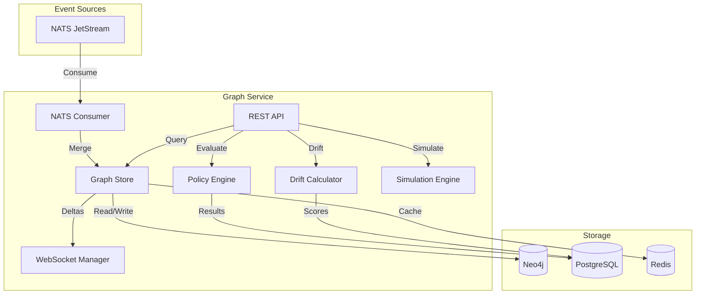

# Graph Service

**Port:** 8082  
**Language:** Python 3.12 / FastAPI  
**Repository:** `services/graph/`

---

## Overview

The Graph Service is the **graph brain** of Substrate. It maintains the live architecture graph, evaluates policies against the graph, computes drift scores, and broadcasts real-time updates to clients.

---

## Responsibilities

1. **Graph Maintenance**: Consume events, update Neo4j, cache snapshots
2. **Policy Evaluation**: OPA/Rego execution against graph state
3. **Drift Computation**: Calculate intent vs reality divergence
4. **Simulation**: What-if analysis for proposed changes
5. **Real-Time Updates**: WebSocket broadcasting

---

## Architecture



---

## Graph Store

### Batch Operations

```python
# Batch node merge
async def merge_nodes_batch(nodes: list[GraphNode]):
    query = """
    UNWIND $nodes AS n
    MERGE (s:Service {id: n.id})
    ON CREATE SET s.first_seen = $now
    SET s.name = n.name, s.domain = n.domain,
        s.status = n.status, s.source = n.source,
        s.meta = n.meta, s.last_seen = $now
    """
    await neo4j.run(query, nodes=nodes, now=datetime.utcnow())

# Batch edge merge
async def merge_edges_batch(edges: list[GraphEdge]):
    query = """
    UNWIND $edges AS e
    MATCH (a {id: e.source})
    MATCH (b {id: e.target})
    MERGE (a)-[r:DEPENDS_ON]->(b)
    SET r.label = e.label, r.weight = e.weight
    """
    await neo4j.run(query, edges=edges)
```

### Batch Size

Process in chunks of 500 to avoid Neo4j transaction memory limits.

### Caching

- Serialize full graph to Redis key `graph:snapshot`
- TTL: 60 seconds
- Invalidated on each consumer merge
- Lazy rebuild on next request

---

## Policy Engine

### OPA Integration

```python
import openpolicyagent.opengo as opa

# Evaluate policy against graph
result = await opa.evaluate(
    policy=rego_source,
    input=graph_snapshot
)
```

### Policy Evaluation Flow

1. Extract relevant subgraph for policy scope
2. Serialize to JSON
3. Send to OPA
4. Parse result
5. Store evaluation in PostgreSQL
6. Publish violations to NATS

### Evaluation Triggers

| Trigger | Description |
|---------|-------------|
| `pr` | Pull request opened/updated |
| `push` | Code pushed |
| `manual` | User-triggered |
| `schedule` | Periodic re-evaluation |

### Pre-Bundled Policies

| Policy | Description | Default |
|--------|-------------|---------|
| `no-circular-deps` | Detect cycles in DEPENDS_ON | Hard-mandatory |
| `api-gateway-first` | All inter-service calls via gateway | Hard-mandatory |
| `service-ownership` | Every service has owner | Soft-mandatory |
| `license-compliance` | No GPL/AGPL in commercial | Hard-mandatory |
| `solid-principles` | SOLID pattern enforcement | Advisory |

---

## Drift Detection

### Algorithm

```python
def compute_drift(intended: Graph, observed: Graph) -> DriftScore:
    intended_set = set(intended.nodes + intended.edges)
    observed_set = set(observed.nodes + observed.edges)
    
    convergences = intended_set & observed_set
    divergences = observed_set - intended_set
    absences = intended_set - observed_set
    
    total = len(convergences) + len(divergences) + len(absences)
    score = (len(divergences) + len(absences)) / total if total > 0 else 0
    
    return DriftScore(
        score=score,
        convergences=list(convergences),
        divergences=list(divergences),
        absences=list(absences)
    )
```

### Thresholds

| Score | Status | Action |
|-------|--------|--------|
| 0.0 - 0.3 | Healthy | None |
| 0.3 - 0.6 | Warning | Alert |
| 0.6 - 1.0 | Critical | Page |

### Storage

Drift scores stored in PostgreSQL with partitioning by month for time-series queries.

---

## Simulation Engine

### What-If Analysis

```python
async def simulate_change(
    current: Graph,
    proposed: GraphDiff
) -> SimulationResult:
    # Clone current graph
    hypothetical = current.clone()
    
    # Apply proposed changes
    hypothetical.apply(proposed)
    
    # Re-evaluate all policies
    evaluations = await evaluate_all_policies(hypothetical)
    
    # Compute drift delta
    drift_before = compute_drift(intended, current)
    drift_after = compute_drift(intended, hypothetical)
    
    return SimulationResult(
        affected_nodes=proposed.affected_nodes,
        policy_evaluations=evaluations,
        drift_delta=drift_after.score - drift_before.score,
        blast_radius=compute_blast_radius(current, proposed)
    )
```

### Use Cases

- "What if I split OrderService into two services?"
- "What breaks if we upgrade axios from 0.27 to 1.x?"
- "Blast radius of removing the legacy gateway?"

---

## WebSocket Broadcasting

### Connection Management

```python
class WebSocketManager:
    def __init__(self):
        self._connections: set[WebSocket] = set()
    
    async def connect(self, ws: WebSocket):
        await ws.accept()
        self._connections.add(ws)
        # Send initial snapshot
        await ws.send_json({"type": "snapshot", ...})
    
    async def disconnect(self, ws: WebSocket):
        self._connections.discard(ws)
    
    async def broadcast(self, delta: dict):
        message = json.dumps(delta)
        results = await asyncio.gather(
            *[ws.send_text(message) for ws in self._connections],
            return_exceptions=True
        )
        # Clean up closed connections
        for ws, result in zip(list(self._connections), results):
            if isinstance(result, Exception):
                await self.disconnect(ws)
```

### Delta Format

```json
{
  "type": "batch",
  "events": [
    {"op": "node_added", "data": {...}},
    {"op": "edge_added", "data": {...}},
    {"op": "node_updated", "data": {...}},
    {"op": "node_removed", "id": "..."}
  ],
  "seq": 42,
  "timestamp": "2026-04-12T10:30:00Z"
}
```

---

## API Endpoints

### Graph Endpoints

| Endpoint | Description |
|----------|-------------|
| `GET /api/graph` | Full graph snapshot |
| `GET /api/graph/nodes/{id}` | Single node + neighbors |
| `GET /api/graph/stats` | Node/edge counts by type |
| `DELETE /api/graph` | Purge all graph data |

### Policy Endpoints

| Endpoint | Description |
|----------|-------------|
| `GET /api/policies` | List policies |
| `POST /api/policies` | Create policy |
| `POST /api/policies/{id}/evaluate` | Evaluate policy |
| `GET /api/policies/{id}/log` | Enforcement log |

### Drift Endpoints

| Endpoint | Description |
|----------|-------------|
| `GET /api/drift` | Current drift score |
| `GET /api/drift/history` | Time-series scores |
| `GET /api/drift/violations` | Active violations |

### Simulation Endpoints

| Endpoint | Description |
|----------|-------------|
| `POST /api/simulate` | Run simulation |
| `GET /api/simulate/{id}` | Get result |

### WebSocket

| Endpoint | Description |
|----------|-------------|
| `WS /ws/graph` | Real-time delta stream |

---

## Performance Targets

| Operation | Target |
|-----------|--------|
| Graph query (10K nodes) | <100ms |
| Batch merge (500 nodes) | <500ms |
| Policy evaluation | <5ms |
| Drift computation | <1s |
| Simulation | <15s |
| WebSocket broadcast | <100ms |
