# System Design

This section provides detailed design documentation for each component of the Substrate Platform.

---

## Services Overview

```mermaid
flowchart TB
    subgraph Frontend["Frontend Layer"]
        UI[React Dashboard]
        Graph[WASM Graph Engine]
    end
    
    subgraph Gateway["Gateway Layer"]
        GW[FastAPI Gateway]
    end
    
    subgraph Services["Service Layer"]
        ING[Ingestion Service]
        GRAPH[Graph Service]
        RAG[RAG Orchestrator]
    end
    
    subgraph Data["Data Layer"]
        NEO4j[(Neo4j)]
        PG[(PostgreSQL)]
        REDIS[(Redis)]
        NATS[NATS JetStream]
    end
    
    UI -->|HTTP/WebSocket| GW
    Graph -->|WebSocket| GW
    
    GW -->|Proxy| ING
    GW -->|Proxy| GRAPH
    GW -->|Proxy| RAG
    
    ING -->|Publish| NATS
    NATS -->|Consume| GRAPH
    
    ING -->|Write| PG
    GRAPH -->|Read/Write| NEO4j
    GRAPH -->|Cache| REDIS
    GRAPH -->|Read| PG
    RAG -->|Query| PG
```

---

## Service Responsibilities

| Service | Core Responsibility | Key Technologies |
|---------|---------------------|------------------|
| **Gateway** | Single ingress point, auth enforcement, routing | FastAPI, JWT, Redis |
| **Ingestion** | Connect external tools, normalize to graph events | FastAPI, NATS, PostgreSQL |
| **Graph Service** | Maintain live graph, evaluate policies, compute drift | FastAPI, Neo4j, OPA, NATS |
| **RAG Orchestrator** | Natural language queries, embeddings, LLM orchestration | FastAPI, pgvector, vLLM |
| **Frontend** | Dashboard UI, graph visualization, real-time updates | React, WASM, WebGL2 |

---

## Communication Patterns

### Synchronous (REST)
- Frontend → Gateway → Services
- Request/response for queries and commands
- JWT authentication on every request

### Asynchronous (NATS)
- Ingestion → NATS → Graph Service
- Event-driven, at-least-once delivery
- Durable consumers with ack-wait

### Real-Time (WebSocket)
- Graph Service → Frontend
- Delta streaming for live updates
- Sequence-tracked with reconnect resume

---

## Design Principles

1. **Single Responsibility**: Each service owns one domain
2. **Event Sourcing**: Immutable event log for auditability
3. **CQRS**: Separate read/write models where beneficial
4. **Idempotency**: All operations safe to retry
5. **Graceful Degradation**: Services continue with reduced functionality when dependencies fail

---

## Service Documentation

- [Gateway Service](gateway.md) — Authentication, routing, rate limiting
- [Ingestion Service](ingestion.md) — Connectors, job system, scheduling
- [Graph Service](graph-service.md) — Graph operations, policies, drift
- [RAG Orchestrator](rag-orchestrator.md) — Natural language, embeddings
- [Frontend](frontend.md) — React dashboard, WASM graph engine
- [Infrastructure](infrastructure.md) — Neo4j, PostgreSQL, Redis, NATS
