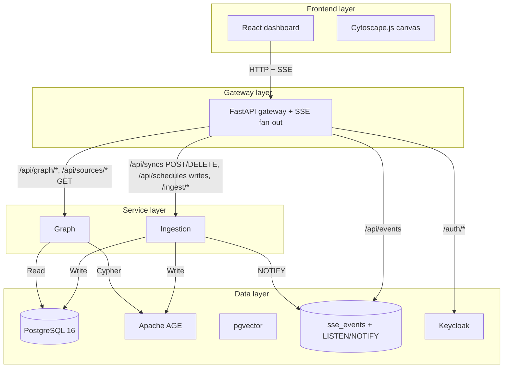

# System Design

Detailed design documentation for each component of the Substrate platform.

---

## Services overview

---

## Service responsibilities

| Service | Core responsibility | Key technologies |
|---|---|---|
| **Gateway** | Single ingress, JWT auth, HTTP proxy, SSE fan-out | FastAPI, PyJWT, httpx, asyncpg (SSE replay only) |
| **Ingestion** | GitHub connector, sync orchestration, AST-aware chunking, embeddings | FastAPI, asyncpg, tree-sitter via substrate-graph-builder |
| **Graph** | Graph queries, semantic search, enriched summaries | FastAPI, asyncpg, pgvector, Apache AGE |
| **Frontend** | Dashboard, graph visualization, source management | React 19, Vite 6, Cytoscape.js, Zustand, TanStack Query |

---

## Communication patterns

### Synchronous HTTP (REST)
- Frontend → frontend's internal nginx → Gateway → Services
- Request/response for all reads and non-lifecycle writes
- JWT `Authorization: Bearer` on every `/api/*` request

### Server push (SSE — Server-Sent Events)
- **Transport:** `GET /api/events` (native browser `EventSource`)
- **Backing:** Postgres `LISTEN/NOTIFY` on channel `substrate_sse`, with a durable `sse_events` replay table
- **Reconnect:** browsers send `Last-Event-ID`; gateway replays rows past that id then streams live
- **Banned:** WebSocket, client polling (`refetchInterval`), Redis. `make lint` fails the build if any reappear in application code.

### Data flow
- Ingestion writes directly to `substrate_graph` (single DB with AGE + pgvector)
- Graph reads from the same database
- No message bus; inter-service sequencing is all via Postgres rows

---

## Service DNS

Container-to-container traffic uses the `substrate_internal` bridge and container DNS — `gateway`, `ingestion`, `graph`, `postgres`, `keycloak`, `pgadmin`. The **only** justified `host.docker.internal` usage is outbound to the host-local lazy-lamacpp LLM endpoints on ports 8101 / 8102.

Host-published ports (for browsers and, in prod, for home-stack NPM):

| Port | Service |
|---|---|
| 3535 | Frontend nginx (container :3000) |
| 5050 | pgadmin |
| 5432 | Postgres |
| 8080 | Keycloak |
| 8180 | Gateway debug (container :8080) |
| 8181 | Ingestion debug (container :8081) |
| 8182 | Graph debug (container :8082) |
| 8101 | Embeddings LLM (host systemd, not a compose service) |
| 8102 | Dense LLM (host systemd, not a compose service) |

---

## Design principles

1. **Single responsibility** — each service owns one domain
2. **Single data boundary** — PostgreSQL + AGE + pgvector; one DB, one pool per service
3. **No mock data** — every graph element comes from real source-code analysis
4. **Idempotency** — ingestion operations are safe to retry; sync_runs is the state machine
5. **Graceful degradation** — missing embeddings / missing AGE edges / LLM failures never block the rest of the pipeline

---

## Service documentation

- [Gateway Service](gateway.md) — auth, routing, SSE fan-out
- [Ingestion Service](ingestion.md) — connectors, sync lifecycle, AST chunking, embeddings
- [Graph Service](graph-service.md) — queries, search, enriched summaries
- [Frontend](frontend.md) — React dashboard, Cytoscape graph
- [Infrastructure](infrastructure.md) — PostgreSQL + AGE + pgvector, Keycloak, lazy-lamacpp
- [Graph Edge Symbols](graph-edge-symbols.md) — edge glyph reference for the node detail panel
