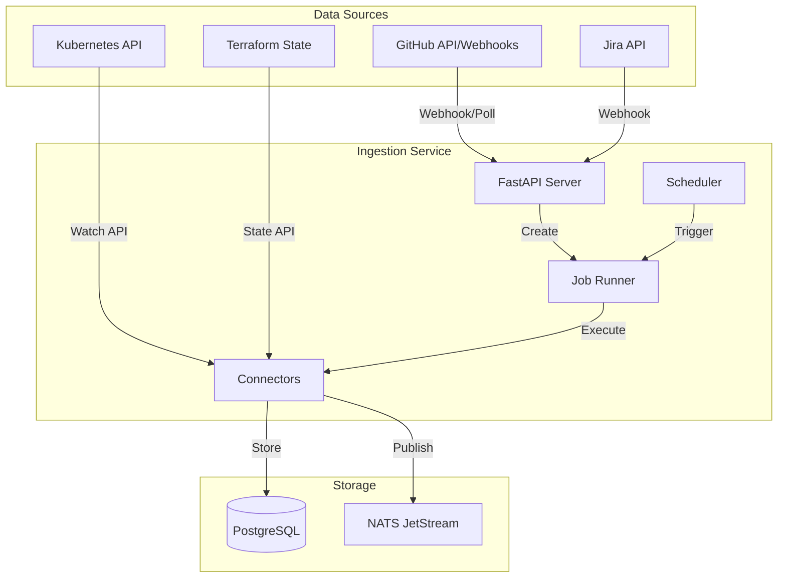

# Ingestion Service

**Port:** 8081  
**Language:** Python 3.12 / FastAPI  
**Repository:** `services/ingestion/`

---

## Overview

The Ingestion Service is the **connector hub** that translates external tool signals into normalized graph events. It maintains the pipeline from raw data sources to the unified knowledge graph.

---

## Responsibilities

1. **Connector Management**: GitHub, Kubernetes, Terraform, Jira connectors
2. **Job Scheduling**: Async job execution with progress tracking
3. **Event Normalization**: Transform raw signals to `GraphEvent` schema
4. **Event Publishing**: Publish to NATS for downstream consumption

---

## Architecture



---

## Connectors

### GitHub Connector

**Capabilities:**
- Repository tree fetching
- AST parsing (C, Python, JavaScript, Go, Rust)
- Import/include dependency extraction
- PR event processing
- CODEOWNERS parsing

**Configuration:**
```python
GITHUB_TOKEN = "ghp_..."
GITHUB_WEBHOOK_SECRET = "..."
FETCH_CONCURRENCY = 20  # Parallel file fetches
```

**Rate Limiting:**
- Read `X-RateLimit-Remaining` header
- Sleep when remaining < 50
- Respect `X-RateLimit-Reset` timestamp

### Kubernetes Connector

**Capabilities:**
- Deployment discovery
- Service topology mapping
- ConfigMap tracking
- Ingress rule extraction

**Configuration:**
```python
KUBE_CONFIG_PATH = "/etc/kube/config"
WATCH_TIMEOUT = 300  # seconds
POLL_INTERVAL = 60   # seconds (fallback)
```

### Terraform Connector

**Capabilities:**
- State file parsing
- Resource dependency extraction
- Provider version tracking
- Module hierarchy mapping

### Jira Connector

**Capabilities:**
- Issue tracking
- Sprint synchronization
- Epic linkage
- Status workflow mapping

---

## Job System

### Job Types

| Type | Description |
|------|-------------|
| `sync` | Full repository sync |
| `incremental` | Delta sync based on timestamp |
| `webhook` | Process incoming webhook |
| `analyze` | Run analysis on existing data |

### Job Lifecycle

```
PENDING -> RUNNING -> COMPLETED
                   -> FAILED
                   -> CANCELLED
```

### Job Schema

```python
class JobRun(BaseModel):
    id: UUID
    job_type: str
    scope: dict  # {repo_url, owner, repo}
    status: str  # pending | running | completed | failed
    progress: dict  # {done: int, total: int}
    result: dict | None
    error: str | None
    created_at: datetime
    started_at: datetime | None
    completed_at: datetime | None
```

---

## Scheduler

### Sync Schedules

```sql
CREATE TABLE sync_schedules (
    id SERIAL PRIMARY KEY,
    owner TEXT NOT NULL,
    repo TEXT NOT NULL,
    interval_minutes INTEGER NOT NULL DEFAULT 60,
    enabled BOOLEAN NOT NULL DEFAULT true,
    last_run TIMESTAMPTZ,
    next_run TIMESTAMPTZ,
    created_at TIMESTAMPTZ NOT NULL DEFAULT now(),
    UNIQUE(owner, repo)
);
```

### Schedule Options

- Off
- 5 minutes
- 15 minutes
- 30 minutes
- 1 hour
- 6 hours
- 24 hours

---

## Event Normalization

### GraphEvent Schema

```python
class GraphEvent(BaseModel):
    source: str           # github | k8s | terraform | jira
    event_type: str       # push | pr_merge | deployment | etc.
    nodes_affected: list[GraphNode]
    edges_affected: list[GraphEdge]
    timestamp: datetime
    
class GraphNode(BaseModel):
    id: str
    type: str             # service | database | cache | external
    name: str
    domain: str | None
    status: str | None
    meta: dict
    
class GraphEdge(BaseModel):
    id: str
    source: str           # node id
    target: str           # node id
    type: str             # depends_on | calls | hosts
    label: str | None
    weight: float
```

### Publishing

```python
# Publish to NATS
await nats_client.publish(
    subject=f"signals.graph.{source}.{event_type}",
    payload=event.json()
)
```

---

## API Endpoints

| Endpoint | Method | Description |
|----------|--------|-------------|
| `/health` | GET | Health check |
| `/jobs` | GET | List jobs |
| `/jobs` | POST | Create job |
| `/jobs/{id}` | GET | Get job status |
| `/jobs/{id}/cancel` | POST | Cancel job |
| `/ingest/schedules` | GET | List schedules |
| `/ingest/schedules` | POST | Create schedule |
| `/ingest/schedules/{id}` | DELETE | Delete schedule |
| `/ingest/schedules/{id}/toggle` | POST | Toggle schedule |
| `/webhooks/github` | POST | GitHub webhook |

---

## Performance Optimizations

### Parallel Fetching

```python
async with asyncio.Semaphore(20):
    await asyncio.gather(*[
        fetch_file(client, file)
        for file in files
    ])
```

### Batch Processing

- Process files in batches of 100
- Commit to PostgreSQL every batch
- Publish progress events every 100 files

### Connection Pooling

Shared `httpx.AsyncClient` for all GitHub API calls:

```python
client = httpx.AsyncClient(
    limits=httpx.Limits(
        max_connections=50,
        max_keepalive_connections=20
    )
)
```

---

## Progress Tracking

Sync progress published to NATS:

```json
{
  "type": "sync_progress",
  "job_id": "...",
  "done": 250,
  "total": 1007,
  "percent": 24.8
}
```

Frontend displays progress in TopBar.
