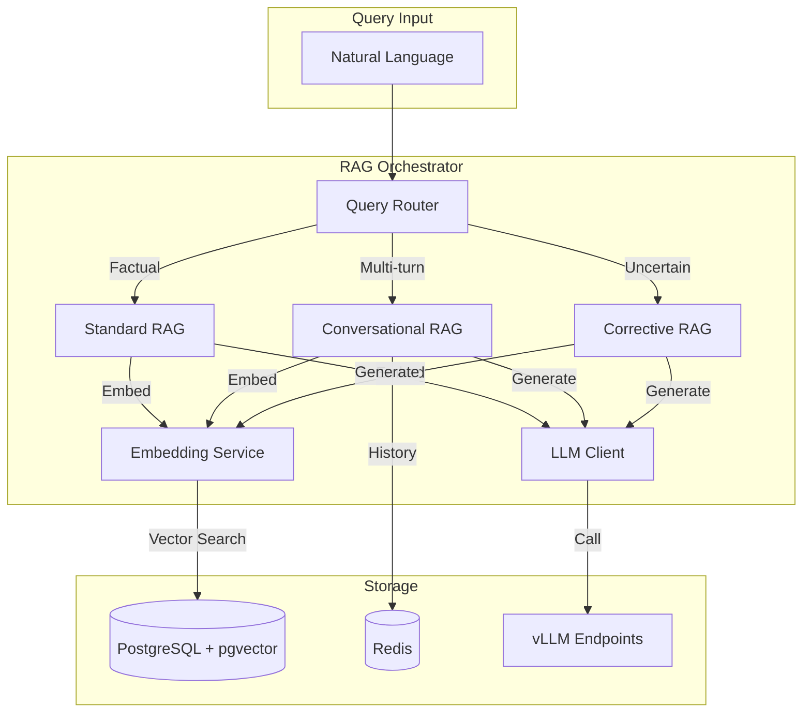

# RAG Orchestrator (SDB)

**Port:** 8083  
**Language:** Python 3.12 / FastAPI  
**Repository:** `services/rag/`

**SDB** = Software-Defined Brain — the natural language interface to the architecture graph.

---

## Overview

The RAG Orchestrator provides intelligent query answering over the Substrate knowledge graph. It uses multiple retrieval strategies to ensure accurate, grounded responses with source citations.

---

## Responsibilities

1. **Query Processing**: Parse natural language queries
2. **Retrieval**: Multiple RAG pipelines (Standard, Conversational, CRAG)
3. **Embedding Management**: BGE-M3 embedding generation and storage
4. **LLM Orchestration**: Route to appropriate local models
5. **Citation Generation**: Link answers to source nodes/policies/ADRs

---

## Architecture



---

## RAG Pipelines

### 1. Standard RAG

For factual queries about current graph state.

**Flow:**
1. Embed query with BGE-M3
2. pgvector similarity search over nodes, ADRs, policies
3. Retrieve top-k chunks
4. LLM generates answer with context
5. Return answer + citations

**Example Query:**
> "What services does PaymentService depend on?"

### 2. Conversational RAG

For multi-turn sessions with context awareness.

**Flow:**
1. Load conversation history from Redis
2. Rewrite query using history (coreference resolution)
3. Execute Standard RAG
4. Store updated history

**Example Session:**
> Q1: "What services does PaymentService depend on?"
> A1: "PaymentService depends on AuthService and Database..."
> Q2: "What about its upstream dependencies?"
> (Resolves "its" to "PaymentService")

**History Storage:**
- TTL: 2 hours
- Key: `conversation:{session_id}`

### 3. CRAG (Corrective RAG)

For handling low-confidence retrievals.

**Flow:**
1. Standard RAG retrieval
2. Relevance grader scores chunks
3. If score < threshold:
   - Rewrite query
   - Re-retrieve
   - Or fallback to graph-direct query
4. Generate with verified context

**Prevents:** Hallucinations on edge cases (new nodes not yet embedded, sparse graph regions)

---

## Retrieval Strategies

### Layered Pipeline

| Strategy | Use Case | Model |
|----------|----------|-------|
| HyDE | Short/vague queries | Dense 70B |
| RAPTOR Tree | Cross-domain synthesis | MoE Scout |
| Local GraphRAG | Dependency questions | Dense cypher-lora |
| Global GraphRAG | Strategic questions | MoE Scout |
| Hybrid RRF Fusion | All queries | bge-reranker |

### HyDE (Hypothetical Document Embeddings)

For queries that don't match document vocabulary:

1. Generate hypothetical answer with LLM
2. Embed the hypothetical answer
3. Use for vector search
4. Retrieve real documents

### RAPTOR Tree Retrieval

Hierarchical summarization:

```
System Overview
├── Domain A Summary
│   ├── Service 1 details
│   └── Service 2 details
├── Domain B Summary
│   └── ...
```

### Hybrid RRF Fusion

Reciprocal Rank Fusion combines results:

```
RRF_score = Σ(1 / (k + rank_i))
where k = 60
```

Merges candidates from:
- Vector search
- Graph traversal
- Keyword search

---

## Embedding Pipeline

### Models

| Model | Purpose | Dimensions |
|-------|---------|------------|
| BGE-M3 | All embeddings | 1024 |
| bge-reranker-v2-m3 | Reranking | - |

### Storage

```sql
-- Nodes with embeddings
CREATE INDEX ON nodes USING ivfflat (embedding vector_cosine_ops);

-- ADRs with embeddings
CREATE INDEX ON adrs USING ivfflat (embedding vector_cosine_ops);

-- Policies with embeddings
CREATE INDEX ON policies USING ivfflat (embedding vector_cosine_ops);
```

### Generation

```python
from sentence_transformers import SentenceTransformer

model = SentenceTransformer("BAAI/bge-m3")

# Embed node description
embedding = model.encode(
    f"{node.name}: {node.meta.get('description', '')}",
    normalize_embeddings=True
)
```

---

## LLM Orchestration

### Model Routing

| Task | Model | Endpoint |
|------|-------|----------|
| Global reasoning | Llama 4 Scout | :8000 |
| Extraction/Explanation | Dense 70B | :8001 |
| Code generation | Qwen2.5-Coder | :8002 (on-demand) |

### Prompt Engineering

**Standard RAG Prompt:**

```
Answer the following question based on the provided context.
Include citations in the format [ADR-023], [POLICY-004], or [node:id].

Context:
{retrieved_chunks}

Question: {query}

Answer:
```

**Cypher Generation Prompt:**

```
Convert the natural language query to a Cypher query.
Only return valid Cypher syntax.

Schema:
- (:Service {id, name, domain, status})
- (:Service)-[:DEPENDS_ON]->(:Service)

Query: {query}

Cypher:
```

---

## API Endpoints

| Endpoint | Description |
|----------|-------------|
| `POST /api/query` | Natural language query (streaming) |
| `GET /api/query/history` | Query history for session |
| `POST /api/query/cypher` | NL → Cypher translation |

### Query Request

```json
{
  "query": "Why does PaymentService require the API gateway?",
  "session_id": "...",
  "stream": true
}
```

### Query Response (Streaming)

```
data: {"chunk": "PaymentService requires the API gateway because..."}
data: {"chunk": " [ADR-047]", "citations": ["ADR-047"]}
data: {"done": true, "sources": [{"type": "adr", "id": "ADR-047"}]}
```

---

## Performance Targets

| Operation | Target |
|-----------|--------|
| Embedding generation | <100ms |
| Vector search | <50ms |
| Simple query response | <1s |
| Complex query (RAPTOR) | <8s |
| Streaming starts | <500ms |

---

## Confidence Scoring

Every response includes confidence metrics:

```json
{
  "answer": "...",
  "confidence": 0.87,
  "retrieval_score": 0.92,
  "source_density": 0.75,
  "citations": [
    {"type": "adr", "id": "ADR-047", "relevance": 0.95},
    {"type": "policy", "id": "POLICY-012", "relevance": 0.88}
  ]
}
```

**Confidence Bands:**
- >0.90: High confidence, auto-accept
- 0.70-0.90: Medium confidence, include citation
- <0.70: Low confidence, suggest verification
